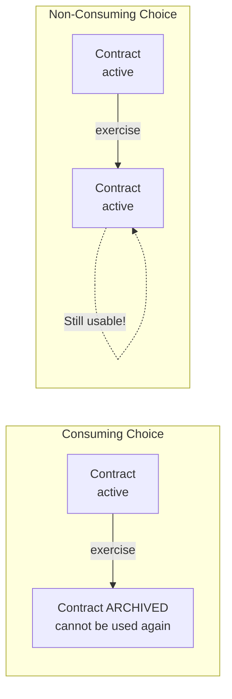
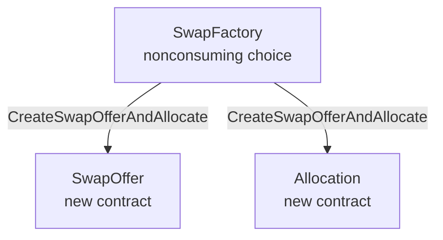
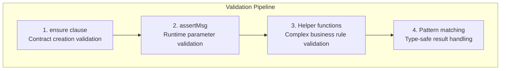

# Module 2: Choices and Contract Interactions

## Learning Objectives

By the end of this module, you will be able to:

- Define and exercise consuming and non-consuming choices
- Understand controller authorization patterns
- Implement the factory pattern for contract creation
- Work with choice parameters and return types
- Chain contract operations using the `do` block

---

## 2.1 What are Choices?

**Choices** are actions that can be performed on a contract. They define the operations available to authorized parties and can modify ledger state by creating, archiving, or exercising other contracts.

### Choice Anatomy

```haskell
choice ChoiceName: ReturnType
  with
    param1: Type1
    param2: Type2
  controller controllerParties
  do
    -- choice body: Update actions
    action1
    action2
    pure result
```

| Component | Description |
|-----------|-------------|
| `choice` keyword | Declares a new choice |
| `ChoiceName` | Unique identifier within the template |
| `ReturnType` | Type of value returned when choice is exercised |
| `with` block | Parameters passed when exercising |
| `controller` | Parties authorized to exercise this choice |
| `do` block | Sequence of Update actions |

---

## 2.2 Consuming vs Non-Consuming Choices

The most important distinction in DAML choices is whether exercising the choice **archives** the contract or not.

### Consuming Choices (Default)

When a consuming choice is exercised, the contract is **archived** and can no longer be used.

Example:

```haskell
choice SwapEscrow_Execute
  : SwapEscrowSettlementResult Allocation_ExecuteTransferResult Allocation_ExecuteTransferResult
  with
    senderExtraArgs: ExtraArgs
    receiverExtraArgs: ExtraArgs
    beneficiaries: Optional [AppRewardBeneficiary]
  controller executor
  do
    -- After this executes, the SwapEscrow contract is archived
    senderAllocation <- fetch senderAllocationCid
    -- ... settlement logic ...
    pure SwapEscrowSettlementResult with
          senderChoiceResult = senderAllocationTransferResult
          receiverChoiceResult = receiverAllocationTransferResult
```

**Use consuming choices when:**

- The action should only happen once (e.g., settlement)
- The contract state becomes invalid after the action
- You want to prevent duplicate executions

### Non-Consuming Choices

Non-consuming choices **do not archive** the contract, allowing it to be used multiple times.

Example:

```haskell
nonconsuming choice CreateTraderAllocation: (ContractId Allocation, ContractId SwapSettlement, Decimal)
  with
    trader: Party
    inputAmount: Decimal
    swapHoldings: [ContractId Holding]
    amuletContext: Optional ChoiceContext
    featuredAppRightCid: Optional (ContractId FeaturedAppRight)
    beneficiaries: Optional [AppRewardBeneficiary]
  controller trader
  do
    -- Quote remains active after this executes
    -- Multiple traders can create allocations against the same quote
    ...
```

**Use non-consuming choices when:**

- Multiple parties need to interact with the same contract
- The contract represents a persistent resource (like a market quote)
- You're implementing a factory pattern

### Visual Comparison



---

## 2.3 Controller Authorization

The `controller` clause specifies which parties can exercise a choice.

### Single Controller

```haskell
choice ArchiveQuote: ()
  controller executor
  do
    pure ()
```

Only the `executor` party can exercise this choice.

### Multiple Controllers (Any of)

```haskell
choice SwapOffer_Reject: ()
  controller receiver
  do
    debug "Trade proposal rejected"
    pure ()
```

### Controllers vs Signatories

| Aspect | Signatory | Controller |
|--------|-----------|------------|
| Role | Must authorize contract creation | Can exercise specific choices |
| Visibility | Always sees the contract | May or may not see the contract |
| Archive | Can always archive | Cannot archive unless also signatory |

### Example: Observer as Controller

Pattern:

```haskell
template SwapEscrow with
    sender: Party
    receiver: Party
    executor: Party
    -- ...
  where
    signatory sender, receiver
    observer executor

    choice SwapEscrow_Execute: ...
      controller executor  -- Observer is the controller!
```

The `executor` is an observer (not a signatory), but can still exercise `SwapEscrow_Execute` because it's explicitly declared as the controller.

---

## 2.4 The Factory Pattern

The **Factory Pattern** uses non-consuming choices to create new contracts without consuming the factory contract itself.

### Why Use Factories?

1. **Reusability** - Same factory can create many contracts
2. **Centralized Validation** - Validation logic in one place
3. **Access Control** - Factory controls who can create contracts
4. **Audit Trail** - Factory contract tracks creations

### Factory Implementation

Example:

```haskell
template SwapFactory with
    admin: Party
  where
    signatory admin

    nonconsuming choice SwapFactory_CreateSwapOfferAndAllocate
      : SwapOfferWithAllocationResult
      with
        sender: Party
        receiver: Party
        executor: Party
        allocationArgs: AllocationArgs
        expectedReceiverAmount: Decimal
        expectedReceiverInstrumentId: InstrumentId
      controller sender
      do
        -- 1. Validation
        assertMsg "Executor mismatch" (executor == allocationArgs.executor)
        assertMsg "Amount must be positive" (allocationArgs.amount > 0.0)
        assertMsg "Expected receiver amount must be positive" (expectedReceiverAmount > 0.0)
        assertMsg "Instrument ID must be different"
          (expectedReceiverInstrumentId /= allocationArgs.instrumentId)

        -- 2. Holdings validation
        validationError <- validateHoldings allocationArgs.inputHoldingCids
          allocationArgs.instrumentId allocationArgs.amount
        case validationError of
          Some msg -> assertMsg ("SwapFactory: " <> msg) False
          None -> pure ()

        -- 3. Generate unique trade reference ID
        now <- getTime
        let tradeReferenceContent = "trade:" <> show now <> ":" <> ...
            tradeReferenceId = sha256 tradeReferenceContent

        -- 4. Create allocation
        let settlementRef = Reference with id = tradeReferenceId, cid = None
        proxiedAllocationResult <- createProxiedAllocation sender receiver allocationArgs settlementRef

        -- 5. Extract allocation CID
        senderAllocationCid <- case proxiedAllocationResult.choiceResult.output of
          AllocationInstructionResult_Completed allocationCid -> pure allocationCid
          AllocationInstructionResult_Pending _ -> error "Allocation pending"
          AllocationInstructionResult_Failed -> error "Allocation failed"

        -- 6. Create the proposal contract
        swapOfferCid <- create SwapOffer with
          featuredAppRightCidOpt = Some allocationArgs.featuredAppRightCid
          ..

        -- 7. Create activity marker
        createFAAM (Some allocationArgs.featuredAppRightCid) allocationArgs.executor allocationArgs.beneficiaries

        pure SwapOfferWithAllocationResult with
          swapOfferCid
          senderAllocationCid
```

### Factory Pattern Diagram



---

## 2.5 Working with the Update Monad

The `do` block in choices uses the **Update monad**, which represents ledger operations.

### Common Update Operations

| Operation | Description | Example |
|-----------|-------------|---------|
| `create` | Create a new contract | `cid <- create Template with ...` |
| `exercise` | Exercise a choice on a contract | `result <- exercise cid Choice with ...` |
| `fetch` | Read contract data | `contract <- fetch cid` |
| `getTime` | Get current ledger time | `now <- getTime` |
| `assertMsg` | Assert condition or fail | `assertMsg "Error" condition` |
| `pure` | Return a value | `pure result` |

### Chaining Operations

Operations in a `do` block are executed sequentially:

```haskell
choice CreateAndSettle: SettlementResult
  controller executor
  do
    -- Step 1: Get current time
    now <- getTime

    -- Step 2: Create an allocation
    allocationCid <- create Allocation with ...

    -- Step 3: Exercise another choice
    transferResult <- exercise allocationCid Allocation_ExecuteTransfer with
      extraArgs = ...

    -- Step 4: Return result
    pure SettlementResult with
      timestamp = now
      transferResult
```

### Handling Optional Values

Pattern:

```haskell
senderAllocationCid <- case proxiedAllocationResult.choiceResult.output of
  AllocationInstructionResult_Completed allocationCid -> pure allocationCid
  AllocationInstructionResult_Pending _ -> error "Allocation instruction pending"
  AllocationInstructionResult_Failed -> error "Allocation failed"
```

Pattern matching extracts values from sum types (variants).

---

## 2.6 Choice Parameters and Return Types

### Parameter Design

Group related parameters using custom types:

Example:

```haskell
data AllocationArgs = AllocationArgs
  with
    executor: Party
    amount: Decimal
    instrumentId: InstrumentId
    allocationFactoryCid: ContractId AllocationFactory
    inputHoldingCids: [ContractId Holding]
    allocateBefore: RelTime
    settleBefore: RelTime
    extraArgs: ExtraArgs
    walletProxyCid: ContractId WalletUserProxy
    featuredAppRightCid: ContractId FeaturedAppRight
    beneficiaries: Optional [AppRewardBeneficiary]
  deriving (Show, Eq)
```

**Benefits:**

- Reduces parameter count in choice signatures
- Makes code more readable
- Enables reuse across multiple choices

### Return Type Design

Example:

```haskell
data SwapOfferWithAllocationResult = SwapOfferWithAllocationResult
  with
    swapOfferCid: ContractId SwapOffer
    senderAllocationCid: ContractId Allocation
  deriving (Show, Eq)
```

### Tuple Return Types

For simple returns, use tuples:

Example:

```haskell
nonconsuming choice CreateTraderAllocation: (ContractId Allocation, ContractId SwapSettlement, Decimal)
```

Returns: `(allocationCid, escrowCid, outputAmount)`

---

## 2.7 Validation Patterns in Choices

### Runtime Assertions

Use `assertMsg` for runtime validation:

Example:

```haskell
-- Validate executor match
assertMsg "SwapFactory: Executor mismatch"
  (executor == allocationArgs.executor)

-- Validate positive amount
assertMsg "SwapFactory: Amount must be positive"
  (allocationArgs.amount > 0.0)

-- Validate different instruments
assertMsg "SwapFactory: Expected receiver instrument ID must be different"
  (expectedReceiverInstrumentId /= allocationArgs.instrumentId)
```

### Validation Helper Functions

Example:

```haskell
validateHoldings :: [ContractId Holding] -> InstrumentId -> Decimal -> Update (Optional Text)
```

Returns `None` if valid, `Some errorMessage` if invalid:

```haskell
validationError <- validateHoldings allocationArgs.inputHoldingCids
  allocationArgs.instrumentId allocationArgs.amount
case validationError of
  Some msg -> assertMsg ("SwapFactory: " <> msg) False
  None -> pure ()
```

### Validation Pattern Summary



---

## 2.8 Exercising Choices

### Direct Exercise

```haskell
-- Create and exercise in sequence
allocationCid <- create Allocation with ...
result <- exercise allocationCid Allocation_ExecuteTransfer with
  extraArgs = ...
```

### Exercise with Fetch

Example:

```haskell
-- Fetch to read data, then validate
senderAllocation <- fetch senderAllocationCid
let senderRefId = (view senderAllocation).allocation.settlement.settlementRef.id
assertMsg
  ("SwapEscrow_Execute: Sender allocation settlementRef.id mismatch")
  (senderRefId == tradeReferenceId)
```

### Helper Functions for Exercise

Pattern:

```haskell
executeAllocationTransfer :
  Party ->
  ContractId Allocation ->
  ExtraArgs ->
  Optional (ContractId FeaturedAppRight) ->
  Optional [AppRewardBeneficiary] ->
  Update (Allocation_ExecuteTransferResult)
executeAllocationTransfer executor allocationCid extraArgs featuredAppRightCid beneficiaries = do
  allocationTransferResult <- exercise allocationCid Allocation_ExecuteTransfer with
    extraArgs = extraArgs

  createFAAM featuredAppRightCid executor beneficiaries

  pure allocationTransferResult
```

This pattern:

1. Exercises the core choice
2. Performs side effects (FAAM creation)
3. Returns the result

---

## 2.9 Advanced: Recursive Choice Patterns

For batch operations, use recursive helper functions. The recursive pattern shown here is useful when processing multiple items in a single transaction.

Example:

```haskell
-- | Recursive helper for creating allocations
createLiquidityProviderAllocationsRecursive :
    [TradeRequestOutput] ->
    [ContractId Holding] ->
    [ContractId Allocation] ->
    AllocationParams ->
    Update ([ContractId Allocation], [ContractId Holding])

-- Base case: no more requests
createLiquidityProviderAllocationsRecursive [] remainingHoldings accAllocations _params =
  pure (reverse accAllocations, remainingHoldings)

-- Recursive case: process one request, continue with rest
createLiquidityProviderAllocationsRecursive (tradeRequestOutput :: rest) currentHoldings accAllocations params = do
  now <- getTime

  let trader = tradeRequestOutput.tradeRequest.trader
      outputAmount = tradeRequestOutput.tradeOutput
      -- ...

  -- Create allocation
  (allocationCid, changeHoldings) <- createAllocation
    params.instrumentId
    params.allocationFactoryCid
    -- ...

  -- Continue with remaining requests using change holdings
  createLiquidityProviderAllocationsRecursive rest changeHoldings (allocationCid :: accAllocations) params
```

**Pattern Explanation:**

1. **Accumulator pattern** - Build result list as you go (`accAllocations`)
2. **State threading** - Pass `changeHoldings` to next iteration
3. **Tail recursion** - Recursive call is the last operation
4. **Reverse at end** - Accumulator builds in reverse order

---

## 2.10 Exercises

### Exercise 2.1: Create a Consuming Choice

Add a `WithdrawAsset` choice to the `DigitalAsset` template from Module 1 that:

- Takes a `recipient: Party` parameter
- Can only be exercised by the `owner`
- Creates a new `DigitalAsset` for the recipient
- Archives the original (consuming)

<details>
<summary>Solution</summary>

```haskell
template DigitalAsset with
    issuer: Party
    owner: Party
    assetName: Text
    quantity: Decimal
  where
    signatory issuer, owner
    ensure quantity > 0.0

    choice WithdrawAsset: ContractId DigitalAsset
      with
        recipient: Party
      controller owner
      do
        -- Create new asset for recipient
        create this with
          owner = recipient
```

</details>

### Exercise 2.2: Create a Non-Consuming Choice

Add a `GetQuote` choice to a `PriceOracle` template that:

- Returns the current price without archiving the contract
- Can be exercised by any party in a `subscribers: [Party]` list

<details>
<summary>Solution</summary>

```haskell
template PriceOracle with
    admin: Party
    assetName: Text
    currentPrice: Decimal
    subscribers: [Party]
  where
    signatory admin
    observer subscribers

    nonconsuming choice GetQuote: Decimal
      controller subscribers
      do
        pure currentPrice
```

</details>

### Exercise 2.3: Implement a Factory

Create a `TokenFactory` template with:

- `admin: Party` as signatory
- A non-consuming `MintToken` choice that:
  - Takes `owner: Party` and `amount: Decimal`
  - Validates `amount > 0.0`
  - Creates a `Token` contract
  - Returns the `ContractId Token`

<details>
<summary>Solution</summary>

```haskell
template Token with
    admin: Party
    owner: Party
    amount: Decimal
  where
    signatory admin, owner
    ensure amount > 0.0

template TokenFactory with
    admin: Party
  where
    signatory admin

    nonconsuming choice MintToken: ContractId Token
      with
        owner: Party
        amount: Decimal
      controller admin
      do
        assertMsg "Amount must be positive" (amount > 0.0)
        create Token with
          admin
          owner
          amount
```

</details>

---

## 2.11 Summary

### Key Takeaways

| Concept | Key Points |
|---------|------------|
| **Consuming Choices** | Archive the contract after exercise; use for one-time actions |
| **Non-Consuming Choices** | Keep contract active; use for queries and factories |
| **Controllers** | Parties authorized to exercise specific choices |
| **Factory Pattern** | Non-consuming choice on factory creates new contracts |
| **Update Monad** | Sequence of ledger operations in `do` block |
| **Validation** | Use `assertMsg` for runtime checks, helper functions for complex rules |

### Choice Design Guidelines

1. **Make choices consuming by default** - Only use non-consuming when needed
2. **Validate early** - Check parameters before performing operations
3. **Return meaningful types** - Use custom types over bare tuples
4. **Group parameters** - Use record types for many parameters
5. **Use helper functions** - Extract complex logic into reusable functions

### Next Module Preview

In **Module 3: Testing in DAML**, you will learn:

- The Daml.Script testing framework
- Party allocation and submission patterns
- Writing assertions and validation tests
- Organizing test infrastructure
