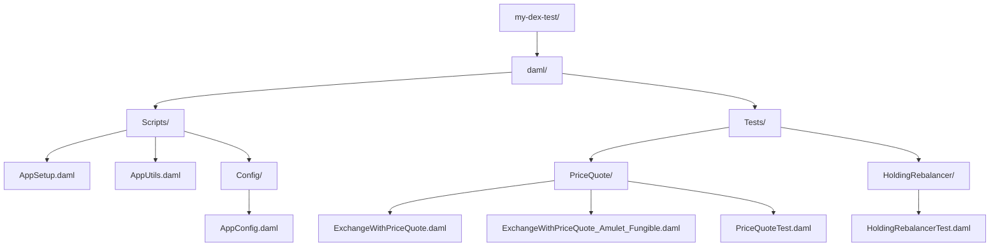

# Module 3: Testing in DAML

## Learning Objectives

By the end of this module, you will be able to:

- Master the Daml.Script testing framework
- Understand party allocation and submission patterns
- Write assertions and validation tests
- Organize test infrastructure with configuration types
- Query contracts and verify state changes

---

## 3.1 Introduction to Daml.Script

**Daml.Script** is DAML's testing framework that allows you to simulate ledger interactions in a controlled environment.

### Key Concepts

| Concept | Description |
|---------|-------------|
| **Script** | A sequence of ledger operations for testing |
| **Party Allocation** | Creating test parties |
| **Submission** | Executing commands as a party |
| **Query** | Reading contract state |
| **Assert** | Validating expected outcomes |

### Basic Test Structure

```haskell
module Tests.MyTest where

import Daml.Script
import DA.Assert

myTest: Script ()
myTest = do
  -- 1. Setup: Allocate parties
  alice <- allocateParty "Alice"
  bob <- allocateParty "Bob"

  -- 2. Execute: Create and exercise contracts
  cid <- submit alice do
    createCmd MyContract with owner = alice, amount = 100.0

  -- 3. Verify: Check results
  Some contract <- queryContractId alice cid
  contract.amount === 100.0

  pure ()
```

---

## 3.2 Party Allocation

### Basic Allocation

```haskell
-- Simple allocation with display name
alice <- allocateParty "Alice"

-- Allocation with specific hint (for deterministic IDs)
trader <- allocatePartyByHint (PartyIdHint "Trader")
```

### Multiple Parties

Example:

```haskell
trader2 <- allocatePartyByHint (PartyIdHint "Trader2")
trader3 <- allocatePartyByHint (PartyIdHint "Trader3")
```

### Party Configuration Pattern

Using parameterized types for flexible party allocation:

Pattern:

```haskell
-- Generic party roles with parameterized party type
data PartyRoles partyRef = PartyRoles with
  liquidityProvider : partyRef
  trader : partyRef
  appProvider : Optional Party
  executor : Optional Party
    deriving (Eq, Show)

-- Optional party roles (for lazy allocation)
type OptionalPartyRoles = PartyRoles (Optional Party)

-- Concrete party roles (all required)
type RequiredPartyRoles = PartyRoles Party
```

### Expanded Roles Pattern

Pattern:

```haskell
-- Fully expanded roles with all parties required
data ExpandedRoles = ExpandedRoles with
  liquidityProvider : Party
  trader : Party
  appProvider : Party
  executor : Party
    deriving (Eq, Show)
```

This pattern allows:

1. Optional configuration (user provides some parties, test allocates others)
2. Type safety (expanded roles guarantee all parties exist)
3. Reusability across different test scenarios

---

## 3.3 Submission Patterns

### Basic Submit

```haskell
cid <- submit alice do
  createCmd MyContract with ...
```

### Submit with Multiple Actions

```haskell
submit alice do
  cid1 <- createCmd Contract1 with ...
  cid2 <- createCmd Contract2 with ...
  exerciseCmd cid1 SomeChoice with ...
```

### actAs and readAs

For fine-grained authorization control:

Example:

```haskell
(trader1AllocationCid, swapSettlementCid1, outputAmount1) <- submit
    (actAs [roles.trader] <>
    readAs [roles.executor, providedAdmin]) do
      exerciseCmd priceQuoteCid CreateTraderAllocation with
        trader = roles.trader
        inputAmount
        swapHoldings = map (coerceContractId . fst) holdings.desired
        amuletContext = None
        featuredAppRightCid = None
        beneficiaries = None
```

**Key Points:**

- `actAs [party]` - Submit commands as this party
- `readAs [parties]` - Can read contracts visible to these parties
- `<>` - Combine permissions (Semigroup)

### Disclosure Patterns

For cross-party visibility:

```haskell
submit (actAs [roles.trader] <> discloseMany allDisclosures) do
    exerciseCmd tradeProposalFactory SwapFactory_CreateSwapOfferAndAllocate with
      sender = roles.trader
      receiver = roles.escrowWallet
```

---

## 3.4 Assertions and Validation

### DA.Assert Module

```haskell
import DA.Assert

-- Equality assertion
result === expectedValue

-- Inequality assertion
result =/= unexpectedValue

-- With custom message
assertMsg "Amount must be positive" (amount > 0.0)
```

### Query and Verify

Example:

```haskell
-- Query contracts by interface
trader1AllocResult <- queryInterface @AllocationV1.Allocation roles.trader

-- Query specific contract by ID
swapSettlementContract <- fromSome <$> queryContractId @SwapSettlement roles.liquidityProvider swapSettlementCid1
```

### Debug Output

```haskell
debug $ "Expected output amount: " <> show expectedOutputAmount
debug "--------------------------------"
debug $ "Trader2: " <> show trader2
```

### Negative Testing with submitMustFail

```haskell
-- Test that invalid operations fail
submitMustFail alice do
  createCmd MyContract with
    amount = -100.0  -- Should fail ensure clause
```

### Try Submit Pattern

```haskell
import DA.Either (isLeft, isRight)

result <- trySubmit alice do
  exerciseCmd cid SomeChoice with ...

-- Check if it succeeded or failed
when (isLeft result) do
  debug "Operation failed as expected"
```

---

## 3.5 Test Configuration Patterns

### Configuration Types

Pattern:

```haskell
data BaseConfig = BaseConfig with
  roles: OptionalPartyRoles
  quotes: [Decimal]
  inputAmount: Decimal

data TestConfig = TestConfig with
  base: BaseConfig
  providedHoldingAmounts: [Decimal]
  desiredHoldingAmounts: [Decimal]

data AppConfig = AppConfig with
  base: BaseConfig
  provided: InstrumentConfig PartyRef InstrumentRef
  desired: InstrumentConfig PartyRef InstrumentRef
  useAmuletTapLockedFunds: Bool
```

### Using Configuration in Tests

Example:

```haskell
exchangeWithPriceQuote: Script ()
exchangeWithPriceQuote = do
  let testConfig: TestConfig = TestConfig with {
    base = BaseConfig with {
      roles = PartyRoles with {
        liquidityProvider = None,  -- Will be allocated
        trader = None,             -- Will be allocated
        appProvider = None,
        executor = None
      },
      quotes = [0.05],
      inputAmount = 100.0
    },
    providedHoldingAmounts = [12000.0],
    desiredHoldingAmounts = [1000.0]
  }

  (AppPresetLightweight {..}, config) <- initializeAppLightweight testConfig
```

### Preset Patterns

**Lightweight Preset** - For simple tests:

Pattern:

```haskell
data AppPresetLightweight = AppPresetLightweight with
  roles: ExpandedRoles
  instruments: Instruments
  holdings: Holdings
  allocationFactories: AllocationFactories
  providedAdmin: Party
  desiredAdmin: Party
```

**Expanded Preset** - For full integration tests:

Pattern:

```haskell
data AppPresetExpanded = AppPresetExpanded with
  roles: ExpandedRoles
  instruments: Instruments
  holdings: Holdings
  allocationFactories: AllocationFactories
  providedAdmin: Party
  desiredAdmin: Party
  featuredAppRights: FeaturedAppRights
  inputAmount: Decimal
  quotes: [Decimal]
  priceQuoteCid: ContractId PriceQuote
  amuletContext: Optional ChoiceContext
  amuletDisclosures: Optional Disclosures'
  svParties: [Party]
  amuletApp: AmuletApp
  amuletRegistry: AmuletRegistry.AmuletRegistry
```

---

## 3.6 Setup Functions

### Initialization Patterns

**Lightweight Initialization:**

Pattern:

```haskell
-- | Lightweight setup for tests that only need PriceQuote creation
initializeAppLightweight: TestConfig -> Script (AppPresetLightweight, AppConfig)
initializeAppLightweight testConfig = do
  appConfig@AppConfig {..} <- setupTest testConfig

  expandedRoles@ExpandedRoles {..} <- expandRoles base.roles

  -- Create only what's needed
  holdingState <- setupHoldings appConfig expandedRoles None

  -- Create the allocation factories
  providedInstrumentAllocationFactoryCid <- createFungibleAllocationFactory providedAdmin None
  desiredInstrumentAllocationFactoryCid <- createFungibleAllocationFactory desiredAdmin None

  -- Create the simple test preset
  let appPresetLightweight = AppPresetLightweight with
        roles = expandedRoles
        instruments = holdingState.instruments
        -- ...
```

**Full Infrastructure Initialization:**

Pattern:

```haskell
-- | Initialize the app with full infrastructure
initializeAppWithAmuletInfrastructure : AppConfig -> Script AppPresetExpanded
initializeAppWithAmuletInfrastructure config = do
  expandedRoles@ExpandedRoles{..} <- expandRoles config.base.roles

  -- Setup DSO infrastructure and featured app rights
  (svParties, amuletApp, amuletRegistry, featuredAppRights) <-
    setupCommonInfrastruture [appProvider, liquidityProvider, executor, trader] None

  -- Setup holdings
  holdingState <- setupHoldings config expandedRoles (Some amuletRegistry)

  -- Create allocation factories
  (allocationFactories, amuletContextOpt, amuletDisclosuresOpt) <-
    createAllocationFactories config expandedRoles amuletRegistry

  -- Create market quote
  priceQuoteCid <- createPriceQuoteWithProposal priceQuoteConfig

  pure AppPresetExpanded with ...
```

---

## 3.7 Query Patterns

### Query by Contract ID

```haskell
-- Query specific contract
Some contract <- queryContractId @SwapSettlement roles.liquidityProvider swapSettlementCid

-- Access contract fields
debug $ "Escrow Id: " <> show contract.escrowId
debug $ "Created at: " <> show contract.createdAt
```

### Query by Interface

```haskell
-- Query all contracts implementing an interface
allocations <- queryInterface @AllocationV1.Allocation roles.trader

-- Returns [(ContractId, View)] pairs
```

### Query Disclosure

```haskell
-- Get disclosure for cross-party visibility
disclosure <- fromSome <$> queryDisclosure @SwapFactory roles.executor factoryCid
```

### Filter Query Results

Example:

```haskell
-- Filter allocations by specific CID
let trader1Allocation = map (\(cid, alloc) ->
      fromSome (if cid == trader1AllocationCid then Some alloc else None)) trader1AllocResult
```

---

## 3.8 Balance Verification

### Wallet Utils

Pattern:

```haskell
-- Check holdings and balances
(traderHoldings, traderBalance) <- WalletUtils.checkHoldingsAndBalances
  trader instrumentId expectedAmounts False

-- List unlocked holdings
unlockedHoldings <- WalletUtils.listUnlockedHoldings party instrumentId

-- Get specific balance types
totalBalance <- WalletUtils.balanceOf party instrumentId
unlockedBalance <- WalletUtils.unlockedBalanceOf party instrumentId
lockedBalance <- WalletUtils.lockedBalanceOf party instrumentId
```

### Before/After Verification

```haskell
-- Before swap
(holdingsBefore, balanceBefore) <- WalletUtils.checkHoldingsAndBalances trader instrumentId amounts False

-- Perform swap
submit trader do
  exerciseCmd escrowCid Settle with ...

-- After swap
(holdingsAfter, balanceAfter) <- WalletUtils.checkHoldingsAndBalances trader instrumentId amounts False

-- Verify change
(balanceAfter - balanceBefore) === expectedChange
```

---

## 3.9 Test Organization

### Test File Structure



### Naming Conventions

| Pattern | Example | Purpose |
|---------|---------|---------|
| `*Test.daml` | `PriceQuoteTest.daml` | Unit/integration tests |
| `ExchangeWith*.daml` | `ExchangeWithPriceQuote.daml` | Full workflow tests |
| `*_Amulet_*.daml` | `ExchangeWithPriceQuote_Amulet_Fungible.daml` | Specific token type tests |

### Test Categories

1. **Unit Tests** - Test individual choices
2. **Integration Tests** - Test multi-contract workflows
3. **Validation Tests** - Test error conditions
4. **End-to-End Tests** - Test complete scenarios

---

## 3.10 Common Testing Patterns

### Happy Path Testing

```haskell
testHappyPath: Script ()
testHappyPath = do
  -- Setup
  (preset, config) <- initializeAppLightweight testConfig

  -- Execute the main workflow
  result <- submit trader do
    exerciseCmd contractCid MainChoice with ...

  -- Verify success
  result.status === "completed"
```

### Error Case Testing

```haskell
testInvalidAmount: Script ()
testInvalidAmount = do
  -- Setup
  (preset, config) <- initializeAppLightweight testConfig

  -- Expect failure for invalid input
  submitMustFail trader do
    exerciseCmd contractCid MainChoice with
      amount = -100.0  -- Invalid!
```

### Concurrent Operations Testing

Example:

```haskell
-- Multiple traders create allocations against same quote
(trader1AllocationCid, _, outputAmount1) <- submit (actAs [roles.trader] <> readAs [...]) do
    exerciseCmd priceQuoteCid CreateTraderAllocation with trader = roles.trader, ...

(trader2AllocationCid, _, outputAmount2) <- submit (actAs [trader2] <> readAs [...]) do
    exerciseCmd priceQuoteCid CreateTraderAllocation with trader = trader2, ...

(trader3AllocationCid, _, outputAmount3) <- submit (actAs [trader3] <> readAs [...]) do
    exerciseCmd priceQuoteCid CreateTraderAllocation with trader = trader3, ...

-- All three succeed because CreateTraderAllocation is non-consuming
```

---

## 3.11 Exercises

### Exercise 3.1: Write a Basic Test

Create a test script that:

1. Allocates two parties: `issuer` and `holder`
2. Creates a `Token` contract with `amount = 100.0`
3. Queries and verifies the token amount

<details>
<summary>Solution</summary>

```haskell
module Tests.BasicTokenTest where

import Daml.Script
import DA.Assert

basicTokenTest: Script ()
basicTokenTest = do
  -- Allocate parties
  issuer <- allocateParty "Issuer"
  holder <- allocateParty "Holder"

  -- Create token
  tokenCid <- submit issuer do
    createCmd Token with
      admin = issuer
      owner = holder
      amount = 100.0

  -- Query and verify
  Some token <- queryContractId holder tokenCid
  token.amount === 100.0

  pure ()
```

</details>

### Exercise 3.2: Test Configuration Pattern

Create a test configuration type and initialization function for a simple escrow test:

1. Define `EscrowTestConfig` with `buyer`, `seller`, and `amount`
2. Create `initializeEscrowTest` that allocates parties
3. Write a test using the configuration

<details>
<summary>Solution</summary>

```haskell
module Tests.EscrowConfigTest where

import Daml.Script
import DA.Assert

data EscrowTestConfig = EscrowTestConfig with
  buyer: Optional Party
  seller: Optional Party
  amount: Decimal

data EscrowTestPreset = EscrowTestPreset with
  buyer: Party
  seller: Party
  amount: Decimal

initializeEscrowTest: EscrowTestConfig -> Script EscrowTestPreset
initializeEscrowTest config = do
  buyer <- case config.buyer of
    Some p -> pure p
    None -> allocateParty "Buyer"
  seller <- case config.seller of
    Some p -> pure p
    None -> allocateParty "Seller"
  pure EscrowTestPreset with
    buyer
    seller
    amount = config.amount

escrowConfigTest: Script ()
escrowConfigTest = do
  let config = EscrowTestConfig with
        buyer = None
        seller = None
        amount = 500.0

  preset <- initializeEscrowTest config

  -- Use preset in test...
  preset.amount === 500.0
```

</details>

### Exercise 3.3: Negative Testing

Write a test that verifies:

1. Creating a token with negative amount fails
2. Creating a token with zero amount fails
3. Creating a token with positive amount succeeds

<details>
<summary>Solution</summary>

```haskell
module Tests.TokenValidationTest where

import Daml.Script
import DA.Assert

tokenValidationTest: Script ()
tokenValidationTest = do
  issuer <- allocateParty "Issuer"
  owner <- allocateParty "Owner"

  -- Test 1: Negative amount should fail
  submitMustFail issuer do
    createCmd Token with
      admin = issuer
      owner
      amount = -100.0

  -- Test 2: Zero amount should fail
  submitMustFail issuer do
    createCmd Token with
      admin = issuer
      owner
      amount = 0.0

  -- Test 3: Positive amount should succeed
  tokenCid <- submit issuer do
    createCmd Token with
      admin = issuer
      owner
      amount = 100.0

  Some token <- queryContractId owner tokenCid
  token.amount === 100.0

  debug "All validation tests passed!"
```

</details>

---

## 3.12 Summary

### Key Takeaways

| Concept | Description |
|---------|-------------|
| **Daml.Script** | Testing framework for simulating ledger interactions |
| **Party Allocation** | `allocateParty`, `allocatePartyByHint` for creating test parties |
| **Submission** | `submit`, `actAs`, `readAs` for executing commands |
| **Assertions** | `===`, `assertMsg`, `submitMustFail` for validation |
| **Queries** | `queryContractId`, `queryInterface` for reading state |
| **Configuration** | Parameterized types for flexible test setup |

### Testing Best Practices

1. **Use configuration types** - Make tests reusable and configurable
2. **Separate setup from verification** - Clear test structure
3. **Test both happy path and error cases** - Comprehensive coverage
4. **Use meaningful debug output** - Aid debugging
5. **Organize tests by feature** - Easy navigation

### Next Module Preview

In **Module 4: Canton Token Standard (CIP-56) Fundamentals**, you will learn:

- CIP-56 architecture and interface hierarchy
- The Holding interface for token ownership
- The Allocation interface for pre-commitment
- Token standard integration patterns
