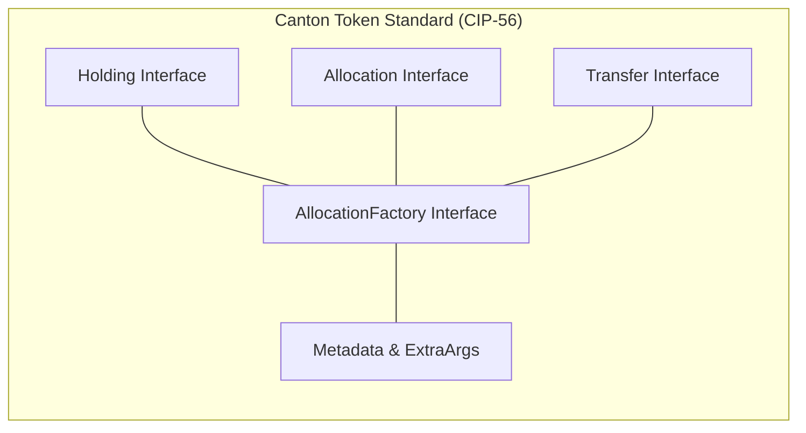
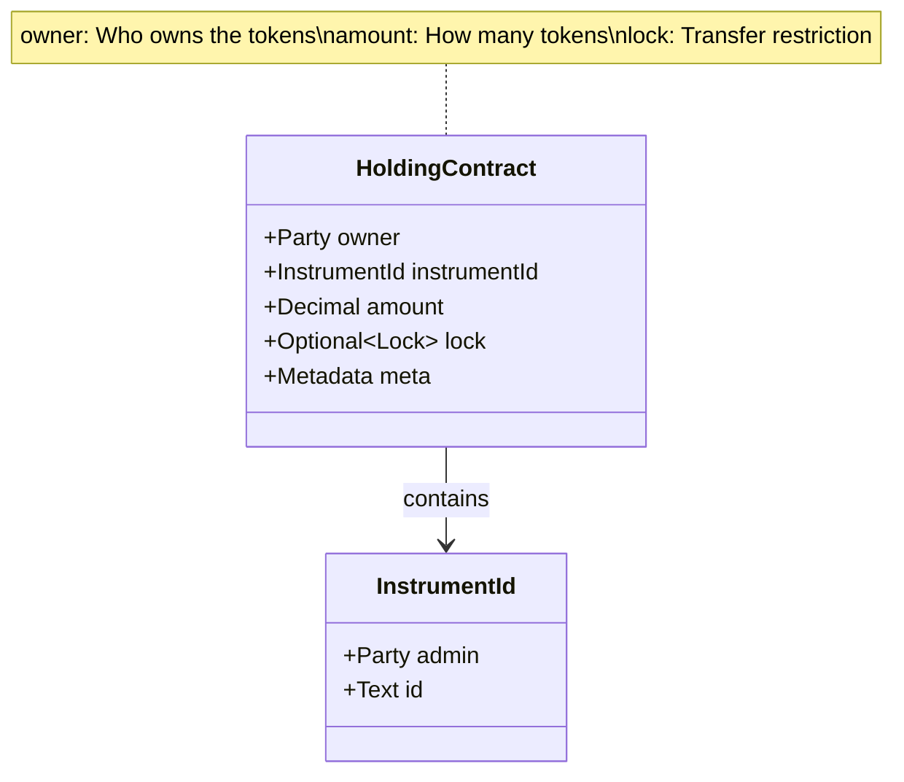
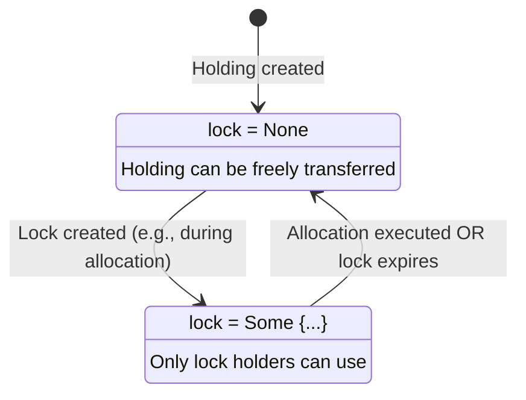
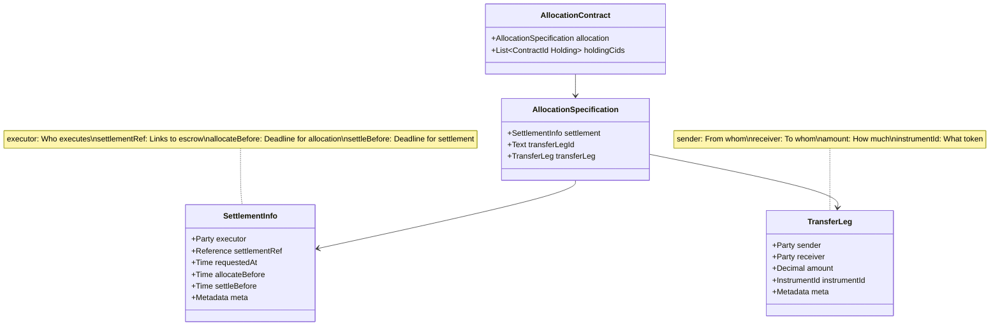
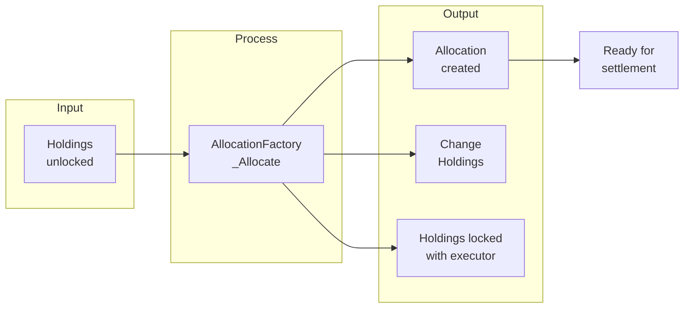

# Module 4: Canton Token Standard (CIP-56) Fundamentals

## Learning Objectives

By the end of this module, you will be able to:

- Understand CIP-56 architecture and interface hierarchy
- Master the Holding interface for token ownership
- Learn the Allocation interface for pre-commitment
- Work with InstrumentId, Lock, and Reference types
- Implement token standard-compliant contracts

---

## 4.1 Introduction to CIP-56

**CIP-56** (Canton Improvement Proposal 56) defines the **Canton Token Standard** - a set of interfaces and patterns for tokenized assets on the Canton Network.

### Why a Token Standard?

| Challenge | CIP-56 Solution |
|-----------|-----------------|
| Interoperability | Common interfaces for all tokens |
| Privacy | Party-scoped visibility |
| Atomicity | Allocation-based settlement |
| Extensibility | Metadata and extra arguments |
| Flexibility | Multiple token types (fungible, Amulet) |

### Core Components



---

## 4.2 InstrumentId: Token Identity

The `InstrumentId` uniquely identifies a token type across the network.

Example:

```haskell
-- | A globally unique identifier for instruments.
data InstrumentId = InstrumentId
  with
    admin : Party
      -- ^ The party representing the registry app that administers the instrument.
    id : Text
      -- ^ The identifier used for the instrument by the instrument admin.
      --
      -- This identifier MUST be unique and unambiguous per instrument admin.
  deriving (Eq, Ord, Show)
```

### Understanding InstrumentId

| Field | Description | Example |
|-------|-------------|---------|
| `admin` | Registry party that manages the token | DSO party for Amulet, Bank for stablecoins |
| `id` | Token identifier within the admin's scope | `"USDT"`, `"CC"`, `"Amulet"` |

### Creating InstrumentIds

```haskell
-- Fungible token (e.g., stablecoin)
let usdtInstrument = InstrumentId with
      admin = bankParty
      id = "USDT"

-- Amulet token (Canton native)
let amuletInstrument = InstrumentId with
      admin = dsoParty  -- DSO is the admin for Amulet
      id = "Amulet"
```

### Comparing InstrumentIds

Pattern:

```haskell
-- Helper function to determine if the instrument is an Amulet token
isAmuletToken : InstrumentId -> Optional Party -> Bool
isAmuletToken instrumentId amuletAllocationFactoryAdmin =
  isSome amuletAllocationFactoryAdmin && instrumentId.admin == fromSome amuletAllocationFactoryAdmin
```

---

## 4.3 The Holding Interface

The `Holding` interface represents token ownership - a party's claim to a specific amount of an instrument.

### HoldingView Structure

Example:

```haskell
-- | Holding interface.
interface Holding where viewtype HoldingView

-- | View for `Holding`.
data HoldingView = HoldingView
  with
    owner : Party
      -- ^ Owner of the holding.
    instrumentId : InstrumentId
      -- ^ Instrument being held.
    amount : Decimal
      -- ^ Size of the holding.
    lock : Optional Lock
      -- ^ Lock on the holding.
    meta : Metadata
      -- ^ Metadata.
  deriving (Eq, Show)
```

### Holding Diagram



### Working with Holdings

**Querying Holdings:**

```haskell
-- Query all holdings for a party
holdings <- queryInterface @HoldingV1.Holding trader

-- Filter by instrument
let traderHoldings = filter (\(_, hv) -> hv.instrumentId == usdtInstrument) holdings
```

**Validating Holdings:**

Pattern:

```haskell
-- | Validate holdings match instrument ID and are sufficient for required amount
validateHoldings : [ContractId HoldingV1.Holding] -> InstrumentId -> Decimal -> Update (Optional Text)
validateHoldings holdingCids expectedInstrumentId requiredAmount = do
  if not (validateHoldingsIsNotEmpty holdingCids) then
    pure (Some "Holdings list is empty")
  else do
    -- Fetch holdings only once
    holdings <- mapA fetch holdingCids
    let holdingViews = map view holdings

    -- Validate instrument ID match
    let mismatchedHoldings = filter (\hv -> hv.instrumentId /= expectedInstrumentId) holdingViews
    if not (null mismatchedHoldings) then do
      pure (Some $ "Holdings do not match expected instrument ID...")
    else do
      -- Validate sufficient amount
      let totalAmount = sum $ map (.amount) holdingViews
      if totalAmount < requiredAmount then
        pure (Some $ "Holdings are not sufficient...")
      else
        pure None
```

---

## 4.4 The Lock Mechanism

Locks restrict how holdings can be used, enabling safe pre-commitment for settlements.

Example:

```haskell
-- | Details of a lock.
data Lock = Lock
  with
    holders : [Party]
      -- ^ Unique list of parties which are locking the contract.
    expiresAt : Optional Time
      -- ^ Absolute, inclusive deadline as of which the lock expires.
    expiresAfter : Optional RelTime
      -- ^ Duration after which the created lock expires.
      -- If both `expiresAt` and `expiresAfter` are set, the lock expires at
      -- the earlier of the two times.
    context : Optional Text
      -- ^ Short, human-readable description of the context of the lock.
  deriving (Eq, Ord, Show)
```

### Lock Use Cases

| Use Case | Lock Configuration |
|----------|-------------------|
| Allocation | `holders = [executor]`, `expiresAt = settleBefore` |
| Escrow | `holders = [escrowAgent]`, `expiresAfter = days 7` |
| Time-Lock | `expiresAt = vestingDate`, `holders = []` |

### Lock Lifecycle



---

## 4.5 The Allocation Interface

The `Allocation` interface represents a **pre-commitment** of assets to a specific transfer leg of a settlement.

### AllocationView Structure

Example:

```haskell
-- | View of a funded allocation of assets to a specific leg of a settlement.
data AllocationView = AllocationView with
    allocation : AllocationSpecification
      -- ^ The settlement for whose execution the assets are being allocated.
    holdingCids : [ContractId Holding]
      -- ^ The holdings that are backing this allocation.
    meta : Metadata
      -- ^ Additional metadata specific to the allocation.
  deriving (Show, Eq)
```

### AllocationSpecification

Example:

```haskell
-- | The specification of an allocation of assets to a specific leg of a settlement.
data AllocationSpecification = AllocationSpecification with
    settlement : SettlementInfo
      -- ^ The settlement for whose execution the assets are being allocated.
    transferLegId : Text
      -- ^ A unique identifer for the transfer leg within the settlement.
    transferLeg : TransferLeg
      -- ^ The transfer for which the assets are being allocated.
  deriving (Show, Eq)
```

### TransferLeg

Example:

```haskell
-- | A specification of a transfer of holdings between two parties.
data TransferLeg = TransferLeg with
    sender : Party
      -- ^ The sender of the transfer.
    receiver : Party
      -- ^ The receiver of the transfer.
    amount : Decimal
      -- ^ The amount to transfer.
    instrumentId : InstrumentId
      -- ^ The instrument identifier.
    meta : Metadata
      -- ^ Additional metadata about the transfer leg.
  deriving (Eq, Ord, Show)
```

### SettlementInfo

Example:

```haskell
-- | The minimal set of information about a settlement.
data SettlementInfo = SettlementInfo
  with
    executor : Party
      -- ^ The party that is responsible for executing the settlement.
    settlementRef : Reference
      -- ^ Reference to the settlement that app would like to execute.
    requestedAt : Time
      -- ^ When the settlement was requested.
    allocateBefore : Time
      -- ^ Until when (exclusive) the senders are given time to allocate.
    settleBefore : Time
      -- ^ Until when (exclusive) the executor is given time to execute.
    meta : Metadata
      -- ^ Additional metadata about the settlement.
  deriving (Show, Eq)
```

### Allocation Diagram



---

## 4.6 Allocation Choices

The Allocation interface defines three key choices:

### Allocation_ExecuteTransfer

Executes the transfer of allocated assets to the receiver.

Example:

```haskell
choice Allocation_ExecuteTransfer : Allocation_ExecuteTransferResult
  -- ^ Execute the transfer of the allocated assets.
  -- This choice SHOULD succeed provided the `settlement.settleBefore` deadline has not yet passed.
  with
    extraArgs : ExtraArgs
      -- ^ Additional context required in order to exercise the choice.
  controller allocationControllers (view this)
  do allocation_executeTransferImpl this self arg
```

**Result:**

```haskell
data Allocation_ExecuteTransferResult = Allocation_ExecuteTransferResult
  with
    senderHoldingCids : [ContractId Holding]
      -- ^ Holdings created for the sender (change).
    receiverHoldingCids : [ContractId Holding]
      -- ^ Holdings created for the receiver.
    meta : Metadata
```

### Allocation_Cancel

Cancels the allocation (requires all controllers).

```haskell
choice Allocation_Cancel : Allocation_CancelResult
  -- ^ Cancel the allocation. Requires authorization from sender, receiver, and executor.
  with
    extraArgs : ExtraArgs
  controller allocationControllers (view this)
```

### Allocation_Withdraw

Sender withdraws before settlement deadline.

```haskell
choice Allocation_Withdraw : Allocation_WithdrawResult
  -- ^ Withdraw the allocated assets. Used by the sender to withdraw before settlement.
  with
    extraArgs : ExtraArgs
  controller (view this).allocation.transferLeg.sender
```

---

## 4.7 Reference Type

The `Reference` type links allocations to settlements.

Example:

```haskell
-- | A generic type to refer to data defined within an app.
data Reference = Reference with
    id : Text
      -- ^ The key that identifies the data.
    cid : Optional AnyContractId
      -- ^ Optional contract-id to use for referring to contracts.
  deriving (Show, Eq)
```

### Creating Settlement References

**Using SHA256 hash for unique, deterministic reference IDs:**

Pattern:

```haskell
-- Using SHA256 hash as reference ID (recommended for unique trades)
let settlementRef = Reference with
      id = tradeReferenceId  -- SHA256 hash of trade details
      cid = None
```

**Alternative pattern using contract reference:**

Pattern:

```haskell
-- Helper function using static ID with contract reference
makeSettlementRef : ContractId AnyContract -> AllocationV1.Reference
makeSettlementRef cid = AllocationV1.Reference with
  id = "SwapSettlementRef"
  cid = Some cid  -- Links to the escrow contract
```

---

## 4.8 Creating Allocations

### The AllocationFactory Interface

Allocations are created via an `AllocationFactory`:

```haskell
exercise instrumentAllocationFactoryCid AllocationFactory_Allocate with
  expectedAdmin = instrumentId.admin
  allocation = AllocationSpecification with ...
  requestedAt = now
  inputHoldingCids = holdingCids
  extraArgs = ...
```

### Complete Allocation Creation

Pattern:

```haskell
-- Helper function to create an allocation
createAllocation :
    InstrumentId ->
    ContractId AllocationFactory ->
    Optional ChoiceContext ->
    RelTime -> RelTime ->
    Text ->
    Party ->
    Reference ->
    Party -> Party -> Decimal ->
    [ContractId Holding] ->
    Optional (ContractId Allocation) ->
    Update (ContractId Allocation, [ContractId Holding])
createAllocation
    instrumentId
    instrumentAllocationFactoryCid
    instrumentChoiceContext
    allocateBefore settleBefore
    transferLegId
    executor
    settlementRef
    sender receiver amount
    inputHoldingCids
    recipientAllocationCidOpt = do

  now <- getTime

  -- Optional: link to recipient allocation via metadata
  transferLegMetadata <- case recipientAllocationCidOpt of
    Some recipientAllocationCid -> do
      pure Metadata { values = TextMap.fromList [("recipientAllocationCid", show recipientAllocationCid)] }
    None -> do
      pure emptyMetadata

  -- Create allocation
  result <- exercise instrumentAllocationFactoryCid AllocationFactory_Allocate with
    expectedAdmin = instrumentId.admin

    allocation = AllocationSpecification with
      transferLegId = transferLegId

      transferLeg = TransferLeg with
        sender = sender
        receiver = receiver
        amount = amount
        instrumentId = instrumentId
        meta = transferLegMetadata

      settlement = SettlementInfo with
        executor = executor
        settlementRef = settlementRef
        requestedAt = now
        allocateBefore = now `addRelTime` allocateBefore
        settleBefore = now `addRelTime` settleBefore
        meta = emptyMetadata

    requestedAt = now
    inputHoldingCids = inputHoldingCids

    extraArgs = ExtraArgs with
      context = fromOptional (ChoiceContext { values = TextMap.empty }) instrumentChoiceContext
      meta = emptyMetadata

  let allocationCid = case result.output of
        AllocationInstructionResult_Completed {allocationCid, ..} -> allocationCid
        _ -> error "unexpected completed result"

  pure (allocationCid, result.senderChangeCids)
```

### Allocation Flow Diagram



---

## 4.9 Metadata and ExtraArgs

### Metadata

Used for extensibility without changing interface definitions:

```haskell
data Metadata = Metadata
  with
    values : TextMap Text
```

**Common Uses:**

```haskell
-- Link allocations
meta = Metadata { values = TextMap.fromList [("recipientAllocationCid", show allocCid)] }

-- Empty metadata
meta = emptyMetadata
```

### ExtraArgs

Context passed at choice execution time:

```haskell
data ExtraArgs = ExtraArgs
  with
    context : ChoiceContext
    meta : Metadata

data ChoiceContext = ChoiceContext
  with
    values : TextMap AnyContract
```

**Why ExtraArgs?**

- Amulet requires runtime context (time-locked rules)
- Enables extensibility without interface changes
- Separates static allocation from dynamic execution

---

## 4.10 Dual Factory Architecture

Token applications typically use **two factory types** for different token types:

### Fungible Tokens

```haskell
-- TokenAllocationFactory for standard fungible tokens
providedInstrumentAllocationFactoryCid <- createFungibleAllocationFactory providedAdmin None
```

- Immediate allocation
- No special context required
- Simple lock mechanism

### Amulet Tokens

```haskell
-- Amulet Registry as AllocationFactory
enrichedAmuletAllocationFactoryChoice <- createAmuletAllocationFactory
  amuletRegistry trader escrowWallet executor
```

- Requires `ChoiceContext`
- Time-locked holdings
- DSO governance rules apply

### Factory Selection Pattern

```haskell
-- Determine which factory to use based on instrument
let allocationFactoryCid = if isAmuletToken instrumentId (Some dsoParty)
      then amuletAllocationFactoryCid
      else fungibleAllocationFactoryCid
```

---

## 4.11 Exercises

### Exercise 4.1: Create an InstrumentId

Create `InstrumentId` instances for:

1. A USD-backed stablecoin administered by `bankParty`
2. A gold token administered by `custodianParty`

<details>
<summary>Solution</summary>

```haskell
-- USD stablecoin
let usdcInstrument = InstrumentId with
      admin = bankParty
      id = "USDC"

-- Gold token
let goldInstrument = InstrumentId with
      admin = custodianParty
      id = "XAUT"
```

</details>

### Exercise 4.2: Validate Holdings

Write a function that validates:

1. Holdings are not empty
2. Total amount is at least the required amount

<details>
<summary>Solution</summary>

```haskell
validateHoldingsAmount : [ContractId Holding] -> Decimal -> Update Bool
validateHoldingsAmount holdingCids requiredAmount = do
  if null holdingCids then
    pure False
  else do
    holdings <- mapA fetch holdingCids
    let totalAmount = sum $ map (\h -> (view h).amount) holdings
    pure (totalAmount >= requiredAmount)
```

</details>

### Exercise 4.3: Build an AllocationSpecification

Create an `AllocationSpecification` for transferring 100 USDT from Alice to Bob, with a 10-minute allocation window and 1-hour settlement window.

<details>
<summary>Solution</summary>

```haskell
buildAllocationSpec : Party -> Party -> Party -> InstrumentId -> Time -> AllocationSpecification
buildAllocationSpec sender receiver executor instrumentId now =
  AllocationSpecification with
    settlement = SettlementInfo with
      executor = executor
      settlementRef = Reference with id = "trade_001", cid = None
      requestedAt = now
      allocateBefore = now `addRelTime` minutes 10
      settleBefore = now `addRelTime` hours 1
      meta = emptyMetadata
    transferLegId = "leg_001"
    transferLeg = TransferLeg with
      sender = sender
      receiver = receiver
      amount = 100.0
      instrumentId = instrumentId
      meta = emptyMetadata
```

</details>

---

## 4.12 Summary

### Key Takeaways

| Concept | Description |
|---------|-------------|
| **InstrumentId** | Globally unique token identifier (admin + id) |
| **Holding** | Token ownership with optional lock |
| **Lock** | Transfer restriction with holders and expiry |
| **Allocation** | Pre-commitment of assets to a settlement leg |
| **Reference** | Link allocations to settlements |
| **ExtraArgs** | Runtime context for choice execution |

### CIP-56 Design Principles

1. **Interface-Based** - Implementations vary, interfaces are stable
2. **Privacy-Preserving** - Only relevant parties see contracts
3. **Atomic Settlement** - All-or-nothing execution
4. **Time-Bounded** - Deadlines prevent indefinite locks
5. **Extensible** - Metadata enables future enhancements

### Next Module Preview

In **Module 5: DVP Settlement Patterns**, you will learn:

- The three-phase concurrency solution
- Trade reference ID binding with SHA256
- Atomic dual allocation execution
- Settlement escrow patterns
