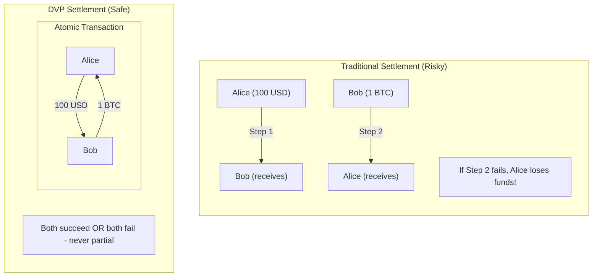
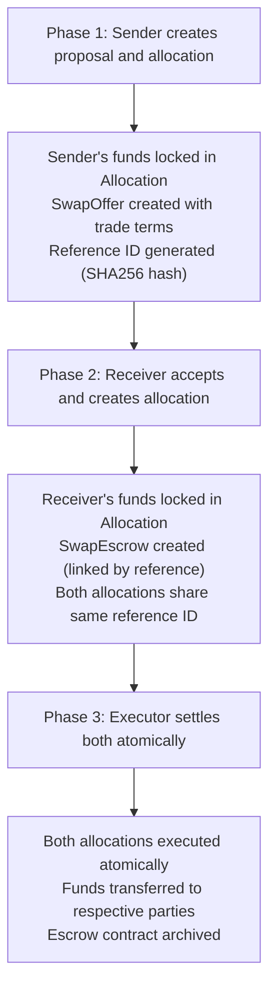
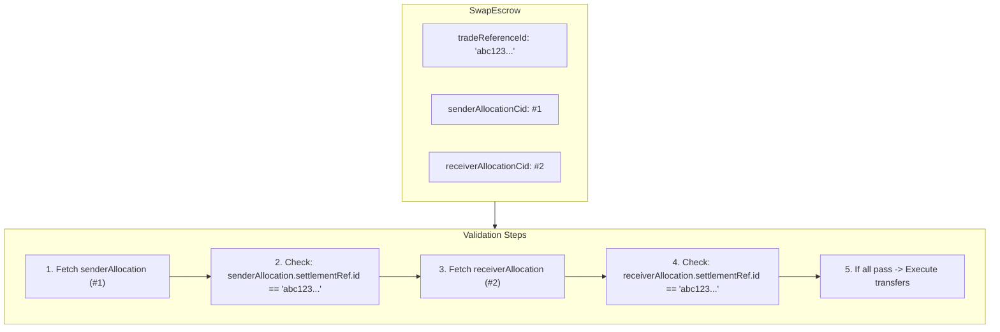
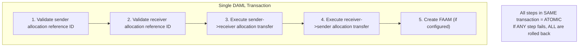
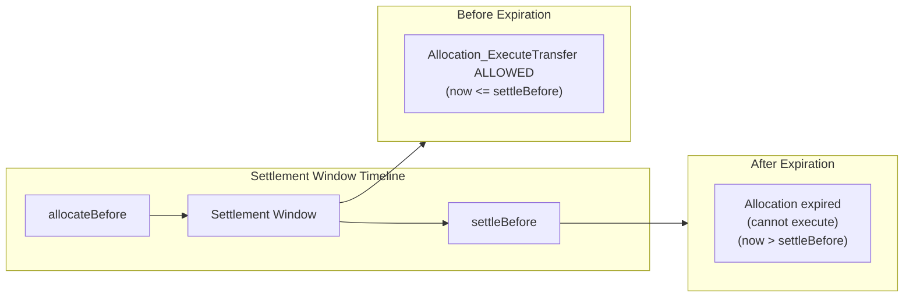
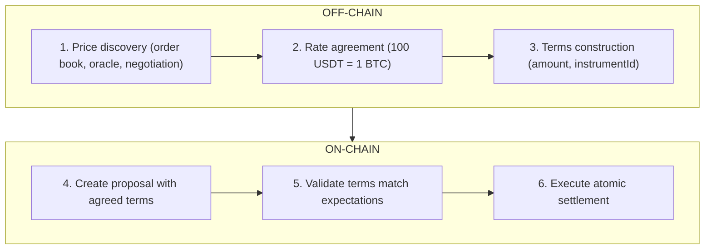
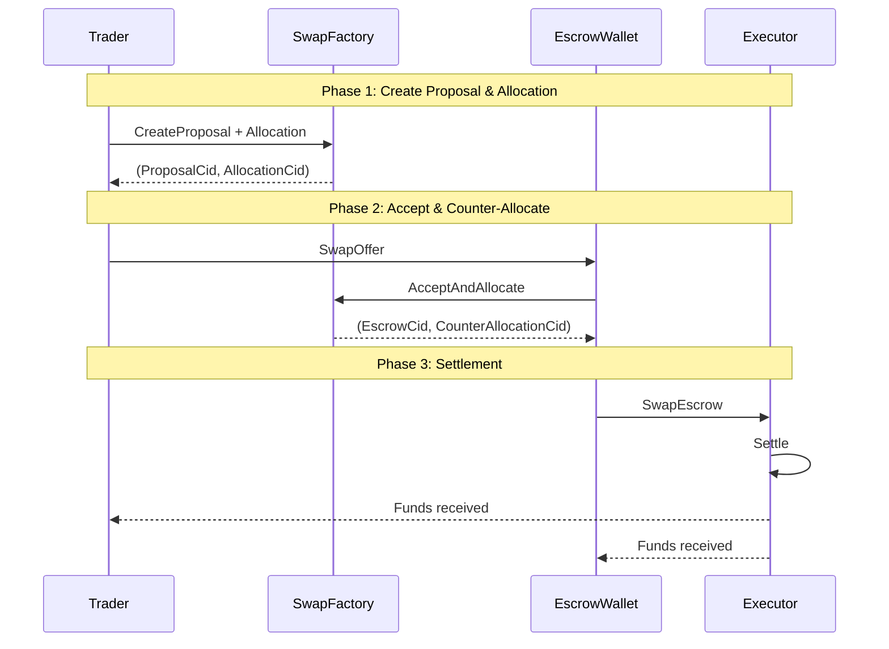

# Module 5: DVP (Delivery vs Payment) Settlement Patterns

## Learning Objectives

By the end of this module, you will be able to:

- Understand atomic DVP settlement principles
- Master the three-phase concurrency solution
- Implement trade reference ID binding with SHA256
- Execute atomic dual allocation settlement
- Handle settlement timeouts and cancellations

---

## 5.1 What is DVP?

**DVP (Delivery versus Payment)** is a settlement mechanism where the transfer of one asset (delivery) occurs simultaneously with the transfer of another asset (payment). This ensures **atomicity** - either both transfers succeed, or neither does.

### Why DVP Matters

| Without DVP | With DVP |
|-------------|----------|
| Sequential transfers | Atomic transfers |
| Risk of partial execution | All-or-nothing execution |
| Counterparty risk | No counterparty risk |
| Complex rollback logic | Automatic rollback |

### DVP in DAML



---

## 5.2 The Three-Phase Concurrency Solution

The DEX uses a **three-phase approach** for DVP settlement that enables concurrent operations while maintaining atomicity.

### Phase Overview



### Why Three Phases?

| Benefit | Explanation |
|---------|-------------|
| **Separation of Concerns** | Each party handles their own allocation independently |
| **Atomicity** | Final settlement executes both transfers in one transaction |
| **Flexibility** | Each phase can be executed by different parties at different times |
| **Timeout Protection** | Allocation expiration prevents indefinite locks |

---

## 5.3 Trade Reference ID Binding

Each trade is uniquely identified by a **SHA256 hash** that binds allocations together.

### Creating the Reference ID

Example:

```haskell
import DA.Text (sha256)

-- Generate unique trade reference ID and hash it
now <- getTime
let tradeReferenceContent =
      "trade:" <> show now <> ":" <>
      allocationArgs.instrumentId.id <> ":" <>
      show sender <> "->" <> show receiver <> ":" <>
      show allocationArgs.amount
    -- Hash the content to get a 64-character hex string (32 bytes)
    tradeReferenceId = sha256 tradeReferenceContent
```

### Reference ID Contents

| Component | Purpose |
|-----------|---------|
| `"trade:"` | Prefix for type identification |
| `show now` | Timestamp for uniqueness |
| `instrumentId.id` | Token being traded |
| `sender -> receiver` | Trade direction |
| `amount` | Trade quantity |

### Example Reference ID

```text
Input:  "trade:2024-01-15T10:30:00Z:USDT:Alice->Bob:100.0"
Output: "a3f2b8c9d4e5f6a7b8c9d0e1f2a3b4c5d6e7f8a9b0c1d2e3f4a5b6c7d8e9f0a1"
```

### Why SHA256?

1. **Collision Resistance** - Virtually impossible to create two different trades with same ID
2. **Deterministic** - Same inputs always produce same output
3. **Fixed Length** - Always 64 characters regardless of input size
4. **Non-Reversible** - Cannot derive trade details from hash alone

---

## 5.4 Allocation CID Storage and Validation

Both allocation contract IDs are stored and validated to ensure correct pairing.

### Storage in SwapEscrow

Pattern:

```haskell
template SwapEscrow with
    sender: Party
    receiver: Party
    executor: Party
    tradeReferenceId: Text
      -- ^ Unique reference ID shared between allocations
    senderAllocationCid: ContractId Allocation
      -- ^ Stored at creation
    receiverAllocationCid: ContractId Allocation
      -- ^ Stored at creation
    featuredAppRightCidOpt: Optional (ContractId FeaturedAppRight)
  where
    signatory sender, receiver
    observer executor

    ensure
      sender /= receiver &&
      executor /= sender &&
      executor /= receiver &&
      senderAllocationCid /= receiverAllocationCid  -- Prevent reuse attack
```

### Validation During Settlement

Pattern:

```haskell
choice SwapEscrow_Execute: ...
  controller executor
  do
    -- Fetch and validate sender allocation
    senderAllocation <- fetch senderAllocationCid
    let senderRefId = (view senderAllocation).allocation.settlement.settlementRef.id
    assertMsg
      ("SwapEscrow_Execute: Sender allocation settlementRef.id mismatch: expected "
       <> tradeReferenceId <> ", got " <> senderRefId)
      (senderRefId == tradeReferenceId)

    -- Fetch and validate receiver allocation
    receiverAllocation <- fetch receiverAllocationCid
    let receiverRefId = (view receiverAllocation).allocation.settlement.settlementRef.id
    assertMsg
      ("SwapEscrow_Execute: Receiver allocation settlementRef.id mismatch: expected "
       <> tradeReferenceId <> ", got " <> receiverRefId)
      (receiverRefId == tradeReferenceId)
```

### Validation Flow Diagram



---

## 5.5 SwapEscrow Settlement Pattern

The `SwapEscrow` contract coordinates atomic settlement of both allocations, following the same patterns established in earlier modules.

### SwapEscrow Structure

Pattern:

```haskell
template SwapEscrow with
    sender: Party
      -- ^ The party who initiates the trade (trader)
    receiver: Party
      -- ^ The party who accepts the trade (escrow wallet)
    executor: Party
      -- ^ The party who will settle the trade
    tradeReferenceId: Text
      -- ^ Unique reference ID shared between allocations and this escrow for correlation
    senderAllocationCid: ContractId Allocation
      -- ^ The sender's allocation contract ID (trader -> escrow wallet)
    receiverAllocationCid: ContractId Allocation
      -- ^ The receiver's allocation contract ID (escrow wallet -> trader)
    featuredAppRightCidOpt: Optional (ContractId FeaturedAppRight)
  where
    signatory sender, receiver
    observer executor

    ensure
      sender /= receiver &&
      executor /= sender &&
      executor /= receiver &&
      senderAllocationCid /= receiverAllocationCid
```

### SwapEscrow_Execute Choice

Pattern:

```haskell
choice SwapEscrow_Execute
  : SwapEscrowSettlementResult Allocation_ExecuteTransferResult Allocation_ExecuteTransferResult
  with
    senderExtraArgs: ExtraArgs
      -- ^ Extra arguments for sender's allocation (e.g., Amulet context)
    receiverExtraArgs: ExtraArgs
      -- ^ Extra arguments for receiver's allocation
    beneficiaries: Optional [AppRewardBeneficiary]
  controller executor
  do
    -- Fetch allocations and validate their settlementRef.id matches tradeReferenceId
    senderAllocation <- fetch senderAllocationCid
    let senderRefId = (view senderAllocation).allocation.settlement.settlementRef.id
    assertMsg
      ("SwapEscrow_Execute: Sender allocation settlementRef.id mismatch: expected "
       <> tradeReferenceId <> ", got " <> senderRefId)
      (senderRefId == tradeReferenceId)

    receiverAllocation <- fetch receiverAllocationCid
    let receiverRefId = (view receiverAllocation).allocation.settlement.settlementRef.id
    assertMsg
      ("SwapEscrow_Execute: Receiver allocation settlementRef.id mismatch: expected "
       <> tradeReferenceId <> ", got " <> receiverRefId)
      (receiverRefId == tradeReferenceId)

    -- Execute sender's allocation transfer using stored CID
    senderAllocationTransferResult <-
      executeAllocationTransfer executor senderAllocationCid senderExtraArgs
        featuredAppRightCidOpt beneficiaries

    -- Execute receiver's allocation transfer using stored CID
    receiverAllocationTransferResult <-
      executeAllocationTransfer executor receiverAllocationCid receiverExtraArgs
        featuredAppRightCidOpt beneficiaries

    pure SwapEscrowSettlementResult with
      senderChoiceResult = senderAllocationTransferResult
      receiverChoiceResult = receiverAllocationTransferResult
```

### Atomic Execution Guarantee



---

## 5.6 Timeout and Cancellation

Timeout protection is handled at two levels:

### Level 1: Proposal Rejection

Before an escrow is created, the receiver can reject the proposal:

Example:

```haskell
choice SwapOffer_Reject: ()
  controller receiver
  do
    debug "Trade proposal rejected"
    pure ()
```

### Level 2: Allocation-Level Expiration (CIP-56)

The CIP-56 Allocation interface includes time constraints:

```haskell
-- Allocation settlement constraints (from CIP-56)
data SettlementInfo = SettlementInfo with
  settlementRef: Reference
    -- ^ Trade reference for correlation
  allocateBefore: Time
    -- ^ Allocation must be created before this time
  settleBefore: Time
    -- ^ Settlement must occur before this time
```

Allocations automatically become invalid after `settleBefore`:



### Cancellation Pattern

If a trade cannot be settled before expiration, allocations can be cancelled to return locked holdings:

```haskell
-- Cancel allocation to return holdings to owner
exercise allocationCid Allocation_Cancel with
  extraArgs = ExtraArgs with
    context = choiceContext
    meta = emptyMetadata
```

### Timeline Summary

| Phase | Action | Protection |
|-------|--------|------------|
| Before Accept | `SwapOffer_Reject` | Receiver rejects proposal |
| After Accept | `SwapEscrow_Execute` | Executor settles within window |
| After Expiration | `Allocation_Cancel` | Return locked funds |

---

## 5.7 Trade Terms Validation

### Off-Chain Exchange Rate Management

> **Important:** Exchange rates are determined **off-chain** before on-chain settlement. The `expectedReceiverAmount` and `expectedReceiverInstrumentId` fields represent terms that have been:
>
> 1. Negotiated between parties through an off-chain service (e.g., order matching engine, price oracle, or manual agreement)
> 2. Agreed upon before the on-chain transaction is submitted
> 3. Validated on-chain to ensure both parties receive what was agreed
>
> The DAML contracts **enforce** the agreed terms but do not **determine** the exchange rate. This separation provides flexibility for different pricing mechanisms while maintaining on-chain settlement guarantees.



### Multi-Point Validation

Multiple validation points ensure trade integrity:

### Phase 1: SwapFactory Validation

Example:

```haskell
-- Validate executor consistency
assertMsg "Executor mismatch" (executor == allocationArgs.executor)

-- Validate positive amounts
assertMsg "Amount must be positive" (allocationArgs.amount > 0.0)
assertMsg "Expected receiver amount must be positive" (expectedReceiverAmount > 0.0)

-- Validate different instruments (no same-token swap)
assertMsg "Expected receiver instrument ID must be different"
  (expectedReceiverInstrumentId /= allocationArgs.instrumentId)

-- Validate holdings
validationError <- validateHoldings allocationArgs.inputHoldingCids
  allocationArgs.instrumentId allocationArgs.amount
case validationError of
  Some msg -> assertMsg ("SwapFactory: " <> msg) False
  None -> pure ()
```

### Phase 2: SwapOffer_AcceptAndAllocate Validation

Example:

```haskell
-- Validate executor consistency
assertMsg "Executor mismatch" (executor == allocationArgs.executor)

-- Validate amount matches expectation
assertMsg "Amount must be positive" (allocationArgs.amount > 0.0)
assertMsg "Allocation amount must match expected receiver amount"
  (allocationArgs.amount == expectedReceiverAmount)

-- Validate instrument matches expectation
assertMsg "Allocation instrument ID must match expected"
  (allocationArgs.instrumentId == expectedReceiverInstrumentId)

-- Validate holdings
validationError <- validateHoldings allocationArgs.inputHoldingCids
  allocationArgs.instrumentId allocationArgs.amount
```

### Validation Summary Table

| Phase | Validation | Purpose |
|-------|------------|---------|
| 1 | `amount > 0` | Positive trade amount |
| 1 | `expectedReceiverAmount > 0` | Positive expected return |
| 1 | `instruments differ` | No same-token swap |
| 1 | `executor match` | Consistent settlement authority |
| 1 | Holdings validation | Sufficient funds |
| 2 | `amount == expected` | Terms agreement |
| 2 | `instrument == expected` | Correct token type |
| 2 | `executor match` | Consistent settlement authority |
| 2 | Holdings validation | Sufficient funds |
| 3 | `settlementRef match` | Correct allocation pairing |
| 3 | `not expired` | Within settlement window |
| 3 | `not settled` | No double settlement |

---

## 5.8 Complete DVP Flow Example

### Sequence Diagram



### Code Example

```haskell
-- Phase 1: Trader creates proposal and allocation
(proposalCid, traderAllocationCid) <- submit trader do
  exerciseCmd factoryCid SwapFactory_CreateSwapOfferAndAllocate with
    sender = trader
    receiver = escrowWallet
    executor = settlementExecutor
    allocationArgs = AllocationArgs with
      amount = 100.0
      instrumentId = usdtInstrument
      ...
    expectedReceiverAmount = 1.0
    expectedReceiverInstrumentId = btcInstrument

-- Phase 2: Escrow wallet accepts and creates counter-allocation
(escrowCid, walletAllocationCid) <- submit escrowWallet do
  exerciseCmd proposalCid SwapOffer_AcceptAndAllocate with
    allocationArgs = AllocationArgs with
      amount = 1.0
      instrumentId = btcInstrument
      ...

-- Phase 3: Executor settles both allocations atomically
submit settlementExecutor do
  exerciseCmd escrowCid SwapEscrow_Execute with
    senderExtraArgs = emptyExtraArgs
    receiverExtraArgs = emptyExtraArgs
    beneficiaries = None
```

---

## 5.9 Exercises

### Exercise 5.1: Calculate Trade Reference ID

Write a function that generates a trade reference ID given trade parameters.

<details>
<summary>Solution</summary>

```haskell
import DA.Text (sha256)

generateTradeRefId : Time -> Text -> Party -> Party -> Decimal -> Text
generateTradeRefId timestamp instrumentId sender receiver amount =
  let content = "trade:" <> show timestamp <> ":" <>
                instrumentId <> ":" <>
                show sender <> "->" <> show receiver <> ":" <>
                show amount
  in sha256 content
```

</details>

### Exercise 5.2: Implement Settlement Validation

Write a function that validates both allocations have matching reference IDs.

<details>
<summary>Solution</summary>

```haskell
validateAllocations :
    Text ->
    ContractId Allocation ->
    ContractId Allocation ->
    Update ()
validateAllocations expectedRefId senderAllocCid receiverAllocCid = do
  senderAlloc <- fetch senderAllocCid
  let senderRefId = (view senderAlloc).allocation.settlement.settlementRef.id
  assertMsg "Sender allocation reference mismatch" (senderRefId == expectedRefId)

  receiverAlloc <- fetch receiverAllocCid
  let receiverRefId = (view receiverAlloc).allocation.settlement.settlementRef.id
  assertMsg "Receiver allocation reference mismatch" (receiverRefId == expectedRefId)

  pure ()
```

</details>

### Exercise 5.3: Design a Simple Escrow

Design a simple escrow template that:

1. Stores buyer, seller, and executor parties
2. Has a `Settle` choice that requires expiration check
3. Includes timeout protection

<details>
<summary>Solution</summary>

```haskell
template SimpleEscrow with
    buyer: Party
    seller: Party
    executor: Party
    createdAt: Time
    expiresAt: Time
    isSettled: Bool
  where
    signatory buyer, seller
    observer executor

    ensure
      buyer /= seller &&
      executor /= buyer &&
      executor /= seller &&
      expiresAt > createdAt

    choice Settle: ()
      with
        buyerAllocationCid: ContractId Allocation
        sellerAllocationCid: ContractId Allocation
      controller executor
      do
        now <- getTime
        assertMsg "Escrow expired" (now <= expiresAt)
        assertMsg "Already settled" (not isSettled)

        -- Execute both allocations
        exercise buyerAllocationCid Allocation_ExecuteTransfer with extraArgs = emptyExtraArgs
        exercise sellerAllocationCid Allocation_ExecuteTransfer with extraArgs = emptyExtraArgs

        pure ()

    choice Cancel: ()
      controller executor
      do
        now <- getTime
        assertMsg "Not yet expired" (now > expiresAt)
        assertMsg "Already settled" (not isSettled)
        pure ()
```

</details>

---

## 5.10 Summary

### Key Takeaways

| Concept | Description |
|---------|-------------|
| **DVP** | Delivery vs Payment - atomic exchange of assets |
| **Three-Phase** | Proposal -> Accept -> Settle enables concurrency |
| **Reference ID** | SHA256 hash binds allocations to the same trade |
| **Escrow** | Coordinates atomic settlement with timeout protection |
| **Validation** | Multi-point validation ensures trade integrity |

### DVP Best Practices

1. **Always use unique reference IDs** - Include timestamp for uniqueness
2. **Validate at every phase** - Don't trust inputs blindly
3. **Set reasonable timeouts** - Balance flexibility vs security
4. **Store allocation CIDs** - Enable validation at settlement
5. **Ensure party separation** - Prevent self-dealing

### Next Module Preview

In **Module 6: Amulet Token Integration**, you will learn:

- Amulet token architecture and rules
- ChoiceContext and ExtraArgs for Amulet operations
- Time-locked holdings
- Dual factory architecture for mixed token types
