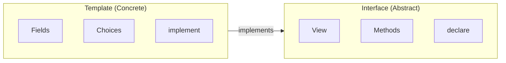

# Module 7: Interface-Based Design

## Learning Objectives

By the end of this module, you will be able to:

- Understand DAML interface concepts and benefits
- Define interfaces with viewtypes
- Implement interfaces in templates
- Query and exercise through interfaces
- Design polymorphic systems using interfaces

---

## 7.1 What are DAML Interfaces?

**Interfaces** in DAML define a contract for behavior that multiple templates can implement. This enables polymorphism - treating different template types uniformly.

### Benefits of Interfaces

| Benefit | Description |
|---------|-------------|
| **Abstraction** | Hide implementation details |
| **Polymorphism** | Treat different types uniformly |
| **Extensibility** | Add new implementations without changing consumers |
| **Type Safety** | Compile-time checking of interface compliance |

### Interface vs Template



---

## 7.2 Defining Interfaces

### Basic Interface Definition

Example:

```haskell
module Interfaces.EscrowInterface where

import Splice.Api.Token.AllocationV1 qualified as AllocationV1
import Splice.Api.FeaturedAppRightV1 (FeaturedAppRight)

-- Define the view (data accessible through interface)
data EscrowView = EscrowView with
    escrowId: Text
    liquidityProvider: Party
    trader: Party
    executor: Party
    allocations: [ContractId AllocationV1.Allocation]
    settlementRef: AllocationV1.Reference
    featuredAppRightCid: Optional (ContractId FeaturedAppRight)
    createdAt: Time
    expiresAt: Time
    settledAt: Optional Time
  deriving (Show, Eq)

-- Define the interface
interface Escrow where
  viewtype EscrowView
```

### Interface Components

| Component | Description |
|-----------|-------------|
| `interface` | Keyword to declare interface |
| `viewtype` | Data type exposed through the interface |
| Methods | Functions that implementations must provide |
| Choices | Actions available on the interface |

---

## 7.3 Implementing Interfaces

### Interface Instance

Example:

```haskell
template SwapSettlement
  with
    escrowId: Text
    liquidityProvider: Party
    trader: Party
    executor: Party
    traderToLiquidityProviderAllocation: ContractId AllocationV1.Allocation
    settlementRef: AllocationV1.Reference
    featuredAppRightCid: Optional (ContractId FeaturedAppRight)
    createdAt: Time
    expiresAt: Time
    settledAt: Optional Time
    pair: Optional Text
  where
    signatory liquidityProvider, trader
    observer executor

    -- Implement the Escrow interface
    interface instance Escrow for SwapSettlement where
      view = EscrowView with
        escrowId = escrowId
        liquidityProvider = liquidityProvider
        trader = trader
        executor = executor
        allocations = [traderToLiquidityProviderAllocation]
        settlementRef = settlementRef
        featuredAppRightCid = featuredAppRightCid
        createdAt = createdAt
        expiresAt = expiresAt
        settledAt = settledAt
```

### Implementation Pattern

```haskell
template MyTemplate with
    field1: Type1
    field2: Type2
  where
    signatory ...

    -- Implement interface
    interface instance MyInterface for MyTemplate where
      view = MyInterfaceView with
        viewField1 = field1
        viewField2 = someTransformation field2
```

---

## 7.4 Working with Interface ContractIds

### Type Coercion

```haskell
-- Convert template ContractId to interface ContractId
interfaceCid = toInterfaceContractId @Allocation templateCid

-- Convert interface ContractId to template ContractId (unsafe)
templateCid = coerceContractId interfaceCid
```

### Storage in Templates

Example:

```haskell
traderToLiquidityProviderAllocation: ContractId AllocationV1.Allocation
  -- ^ Stored as interface ContractId
```

---

## 7.5 Querying Through Interfaces

### Query Interface

```haskell
-- Query all contracts implementing an interface
allocations <- queryInterface @AllocationV1.Allocation trader

-- Returns [(ContractId Allocation, AllocationView)]
```

### Accessing View

```haskell
-- Fetch and access view
allocation <- fetch allocationCid
let allocView = view allocation

-- Access view fields
let amount = allocView.allocation.transferLeg.amount
let sender = allocView.allocation.transferLeg.sender
```

---

## 7.6 CIP-56 Interfaces

The Canton Token Standard defines several key interfaces:

### Holding Interface

```haskell
interface Holding where
  viewtype HoldingView

data HoldingView = HoldingView with
  owner : Party
  instrumentId : InstrumentId
  amount : Decimal
  lock : Optional Lock
  meta : Metadata
```

### Allocation Interface

```haskell
interface Allocation where
  viewtype AllocationView

  -- Methods
  allocation_executeTransferImpl : ContractId Allocation -> ... -> Update ...
  allocation_cancelImpl : ContractId Allocation -> ... -> Update ...
  allocation_withdrawImpl : ContractId Allocation -> ... -> Update ...

  -- Choices
  choice Allocation_ExecuteTransfer : Allocation_ExecuteTransferResult
  choice Allocation_Cancel : Allocation_CancelResult
  choice Allocation_Withdraw : Allocation_WithdrawResult
```

---

## 7.7 Design Patterns with Interfaces

### Factory Pattern with Interfaces

```haskell
-- Factory returns interface ContractId
interface AllocationFactory where
  viewtype AllocationFactoryView

  choice AllocationFactory_Allocate : AllocationInstructionResult
    with
      allocation : AllocationSpecification
      inputHoldingCids : [ContractId Holding]
      extraArgs : ExtraArgs
    controller ...
```

### Polymorphic Processing

```haskell
-- Process any contract implementing Escrow interface
processEscrow : ContractId Escrow -> Update ()
processEscrow escrowCid = do
  escrow <- fetch escrowCid
  let escrowView = view escrow

  -- Access through interface view
  debug $ "Escrow ID: " <> escrowView.escrowId
  debug $ "Trader: " <> show escrowView.trader
```

---

## 7.8 Exercises

### Exercise 7.1: Define an Interface

Create an interface for a `Tradeable` contract with fields: `owner`, `assetType`, `value`.

<details>
<summary>Solution</summary>

```haskell
data TradeableView = TradeableView with
  owner : Party
  assetType : Text
  value : Decimal
  deriving (Show, Eq)

interface Tradeable where
  viewtype TradeableView
```

</details>

### Exercise 7.2: Implement the Interface

Create a `Stock` template that implements the `Tradeable` interface.

<details>
<summary>Solution</summary>

```haskell
template Stock with
    issuer: Party
    holder: Party
    symbol: Text
    quantity: Decimal
    pricePerShare: Decimal
  where
    signatory issuer, holder

    interface instance Tradeable for Stock where
      view = TradeableView with
        owner = holder
        assetType = "Stock:" <> symbol
        value = quantity * pricePerShare
```

</details>

---

## 7.9 Summary

### Key Takeaways

| Concept | Description |
|---------|-------------|
| **Interface** | Abstract contract for behavior |
| **viewtype** | Data type exposed through interface |
| **interface instance** | Template implementing an interface |
| **toInterfaceContractId** | Convert template to interface ContractId |
| **queryInterface** | Query contracts by interface |

### Interface Design Guidelines

1. **Keep views minimal** - Only include necessary data
2. **Design for polymorphism** - Think about multiple implementations
3. **Use meaningful names** - Clear interface and view names
4. **Document expectations** - What implementations should provide
