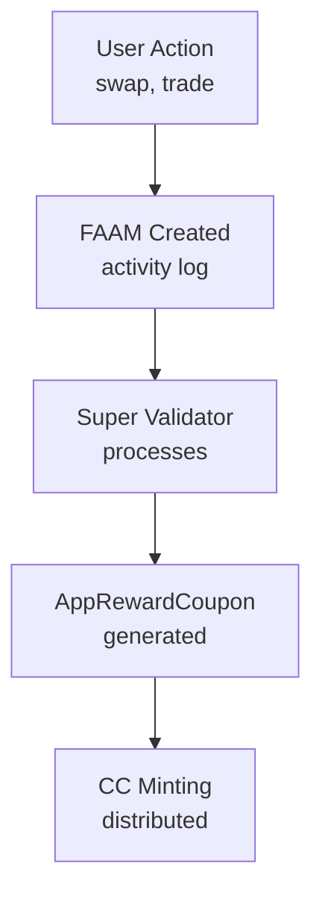
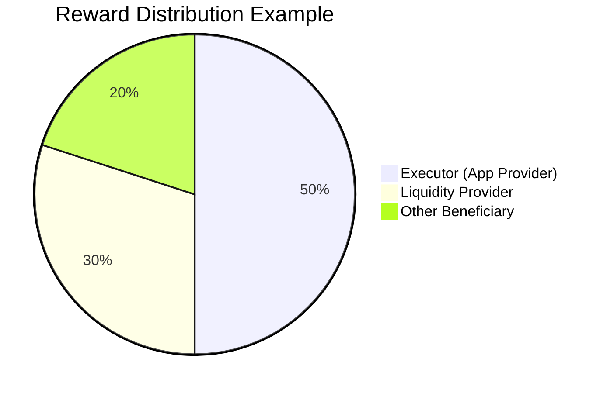
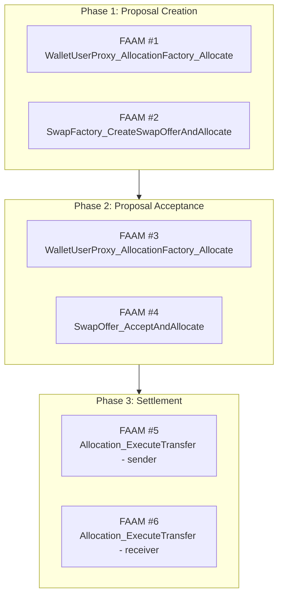

# Module 8: Featured App Activity Marker (FAAM) Integration

## Learning Objectives

By the end of this module, you will be able to:

- Understand Canton Network tokenomics and rewards
- Master FAAM creation patterns
- Configure AppRewardBeneficiary weights
- Implement multi-phase FAAM creation
- Use WalletUserProxy for activity attribution

---

## 8.1 Understanding Canton Network Rewards

The Canton Network incentivizes application usage through **CC (Canton Coin)** rewards. Apps earn rewards by creating **Featured App Activity Markers (FAAMs)**.

### Reward Flow



### Key Components

| Component | Description |
|-----------|-------------|
| **FeaturedAppRight** | Permission to create FAAMs |
| **FAAM** | Activity record triggering rewards |
| **AppRewardBeneficiary** | Recipient of reward share |
| **CC (Canton Coin)** | Reward token |

---

## 8.2 FeaturedAppRight

A `FeaturedAppRight` contract grants permission to create FAAMs.

### Obtaining FeaturedAppRight

```haskell
-- In test setup, FeaturedAppRights are created for each role
(svParties, amuletApp, amuletRegistry, [
    appProviderFeaturedAppRightCid,
    liquidityProviderFeaturedAppRightCid,
    executorFeaturedAppRightCid
  ]) <- setupCommonInfrastruture [appProvider, liquidityProvider, executor, trader] None
```

### Storage Pattern

```haskell
-- Store FeaturedAppRights for different roles
data FeaturedAppRights = FeaturedAppRights with
  appProvider : ContractId FeaturedAppRight
  liquidityProvider : ContractId FeaturedAppRight
  executor : ContractId FeaturedAppRight
```

---

## 8.3 Creating FAAMs

### The createFAAM Helper

Example:

```haskell
-- | Create featured app activity markers for provided beneficiaries
createFAAM: Optional (ContractId FeaturedAppRight) -> Party -> Optional [AppRewardBeneficiary] -> Update ()
createFAAM featuredAppRightCid appProviderBeneficiary externalBeneficiaries = do
  if isSome featuredAppRightCid
    then do
      let
        baseAppProviderReward: Decimal = 1.0
        baseAppProviderBeneficiary = AppRewardBeneficiary appProviderBeneficiary baseAppProviderReward

      beneficiaries <-
        if isSome externalBeneficiaries
          && not (null (fromSome externalBeneficiaries))
          then do
            -- Calculate external beneficiaries' total reward
            let beneficiaries = fromSome externalBeneficiaries
            let externalReward = sum (map (\b -> b.weight) beneficiaries)
            -- Remaining for app provider
            let remainingRewardForAppProvider = baseAppProviderReward - externalReward
            pure (beneficiaries <> [AppRewardBeneficiary appProviderBeneficiary remainingRewardForAppProvider])
          else do
            -- App provider takes full reward
            pure [baseAppProviderBeneficiary]

      FeaturedAppRight_CreateActivityMarkerResult _ <-
        exercise (fromSome featuredAppRightCid) FeaturedAppRight_CreateActivityMarker with beneficiaries

      debug "FeaturedAppActivityMarker successfully created."
    else do
      debug "No FeaturedAppRight found. Skipping activity marker creation."

  pure ()
```

### Usage in Choices

Example:

```haskell
-- Create the FeaturedAppActivityMarker for this activity
createFAAM (Some allocationArgs.featuredAppRightCid) allocationArgs.executor allocationArgs.beneficiaries
```

---

## 8.4 AppRewardBeneficiary Configuration

### Beneficiary Structure

```haskell
data AppRewardBeneficiary = AppRewardBeneficiary with
  party : Party     -- Who receives the reward
  weight : Decimal  -- Proportion of reward (0.0 to 1.0)
```

### Weight Distribution



Total Reward: 1.0 (100%)

- Executor (App Provider): 0.5 (50%)
- Liquidity Provider: 0.3 (30%)
- Other Beneficiary: 0.2 (20%)

### Configuring Beneficiaries

```haskell
-- Define beneficiary list
let beneficiaries : Optional [AppRewardBeneficiary] = Some [
      AppRewardBeneficiary roles.liquidityProvider 0.3,
      AppRewardBeneficiary roles.appProvider 0.2
    ]
    -- Remaining 0.5 goes to executor (default app provider)
```

---

## 8.5 Multi-Phase FAAM Creation

The DEX creates **6 FAAMs** per swap for comprehensive activity tracking.

### FAAM Creation Points

| FAAM # | Phase | Source Contract | Trigger |
|--------|-------|-----------------|---------|
| 1 | Phase 1 | WalletUserProxy | Trader allocation |
| 2 | Phase 1 | SwapFactory | Proposal creation |
| 3 | Phase 2 | WalletUserProxy | Escrow allocation |
| 4 | Phase 2 | SwapOffer | Proposal accept |
| 5 | Phase 3 | AllocationFactory | Sender transfer |
| 6 | Phase 3 | AllocationFactory | Receiver transfer |

### Phase Diagram



---

## 8.6 WalletUserProxy Pattern

The `WalletUserProxy` enables activity attribution when users interact through an app.

### WalletUserProxy Structure

```haskell
template WalletUserProxy with
    provider : Party
      -- ^ The app provider whose featured app right should be triggered
    providerWeight : Decimal
      -- ^ Reward weight for the provider
    userWeight : Decimal
      -- ^ Reward weight for the user (0.0 if no user reward)
    extraBeneficiaries : [AppRewardBeneficiary]
      -- ^ Additional beneficiaries
    optAllowList : Optional [Party]
      -- ^ Optional allow list of parties that can use the proxy
  where
    ensure validProxy this
    signatory provider
```

### Creating WalletUserProxy

```haskell
walletProxyCid <- submit roles.executor do
  createCmd WalletUserProxy with
    provider = roles.executor
    providerWeight = 1.0
    userWeight = 0.0
    extraBeneficiaries = []
    optAllowList = None
```

### Proxy Choices

```haskell
-- Proxied allocation creation
nonconsuming choice WalletUserProxy_AllocationFactory_Allocate
  : ProxyResult AllocationInstructionResult
  with
    cid : ContractId AllocationFactory
    proxyArg : ProxyArg AllocationFactory_Allocate
  controller proxyArg.user
```

---

## 8.7 Integration in Trade Workflow

### AllocationArgs with FAAM Support

```haskell
data AllocationArgs = AllocationArgs
  with
    executor: Party
    amount: Decimal
    instrumentId: InstrumentId
    allocationFactoryCid: ContractId AllocationFactory
    inputHoldingCids: [ContractId Holding]
    allocateBefore: RelTime
    settleBefore: RelTime
    extraArgs: ExtraArgs
    walletProxyCid: ContractId WalletUserProxy     -- For FAAM creation
    featuredAppRightCid: ContractId FeaturedAppRight -- Required for FAAM
    beneficiaries: Optional [AppRewardBeneficiary]   -- Reward distribution
```

### Complete Example

```haskell
-- Create trade proposal with FAAM
submit trader do
  exerciseCmd factoryCid SwapFactory_CreateSwapOfferAndAllocate with
    sender = trader
    receiver = escrowWallet
    executor = roles.executor
    allocationArgs = AllocationArgs with
      executor = roles.executor
      amount = 100.0
      instrumentId = usdtInstrument
      allocationFactoryCid = allocationFactories.desired
      inputHoldingCids = map fst holdings.desired
      allocateBefore = minutes 10
      settleBefore = hours 1
      extraArgs = emptyExtraArgs
      walletProxyCid = walletProxy
      featuredAppRightCid = featuredAppRights.executor
      beneficiaries = Some [
        AppRewardBeneficiary roles.liquidityProvider 0.3
      ]
    expectedReceiverAmount = 1.0
    expectedReceiverInstrumentId = btcInstrument
```

---

## 8.8 Exercises

### Exercise 8.1: Calculate Beneficiary Weights

Given external beneficiaries with weights [0.2, 0.3], calculate the remaining weight for the app provider.

<details>
<summary>Solution</summary>

```haskell
calculateRemainingWeight : [AppRewardBeneficiary] -> Decimal
calculateRemainingWeight beneficiaries =
  let externalTotal = sum (map (\b -> b.weight) beneficiaries)
  in 1.0 - externalTotal

-- Example:
-- External: 0.2 + 0.3 = 0.5
-- Remaining: 1.0 - 0.5 = 0.5
```

</details>

### Exercise 8.2: Create FAAM with Custom Beneficiaries

Write code to create a FAAM with 40% to LP, 20% to referrer, and 40% to app provider.

<details>
<summary>Solution</summary>

```haskell
let beneficiaries = Some [
      AppRewardBeneficiary liquidityProvider 0.4,
      AppRewardBeneficiary referrer 0.2
    ]
    -- Remaining 0.4 goes to executor (app provider)

createFAAM (Some featuredAppRightCid) executor beneficiaries
```

</details>

---

## 8.9 Summary

### Key Takeaways

| Concept | Description |
|---------|-------------|
| **FAAM** | Activity marker triggering CC rewards |
| **FeaturedAppRight** | Permission to create FAAMs |
| **AppRewardBeneficiary** | Recipient with weight |
| **WalletUserProxy** | Activity attribution for user actions |
| **Multi-Phase FAAM** | 6 FAAMs per swap for full tracking |

### FAAM Best Practices

1. **Always pass FeaturedAppRight** - Required for FAAM creation
2. **Configure beneficiaries carefully** - Weights must sum to <= 1.0
3. **Use WalletUserProxy** - For user-initiated actions
4. **Create FAAMs at key points** - Allocation, acceptance, settlement
