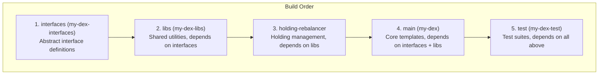
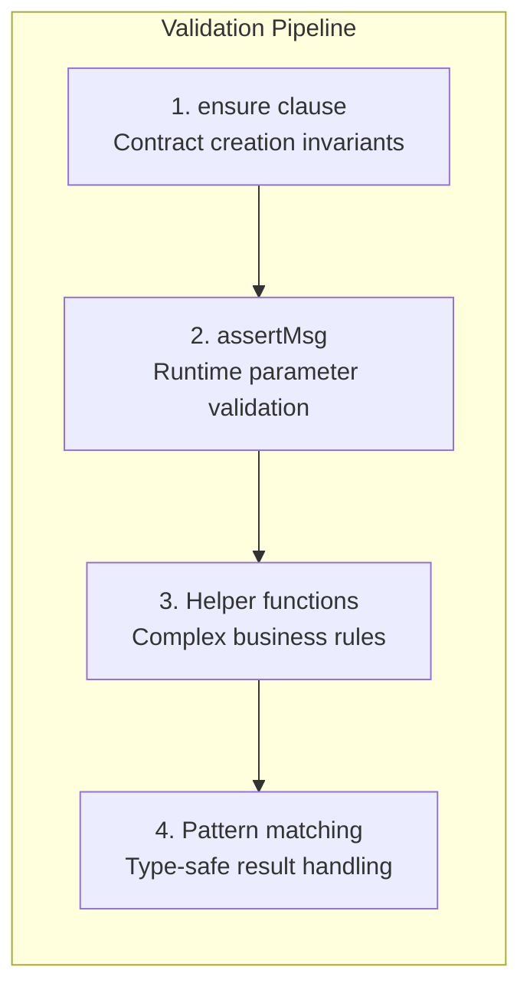

# Module 9: Production Patterns and Best Practices

## Learning Objectives

By the end of this module, you will be able to:

- Master multi-package project structure
- Understand security validation patterns
- Implement comprehensive error handling
- Organize utility modules effectively
- Apply production-ready design patterns

---

## 9.1 Multi-Package Project Structure

### Package Hierarchy

The DEX uses a layered architecture with clear dependencies:



### daml.yaml Configuration

```yaml
# exchange/daml.yaml
sdk-version: 3.4.9
name: my-dex
version: 2.4.1
dependencies:
  - daml-prim
  - daml-stdlib
data-dependencies:
  - ../interfaces/.daml/dist/my-dex-interfaces-1.0.0.dar
  - ../libs/.daml/dist/my-dex-libs-1.0.2.dar
build-options:
  - --target=2.2
  - -Wunused-binds
  - -Wunused-matches
```

### Benefits of Multi-Package

| Benefit | Description |
|---------|-------------|
| **Separation of Concerns** | Clear boundaries between components |
| **Reusability** | Libs can be shared across projects |
| **Testability** | Test packages can import all components |
| **Versioning** | Independent versioning per package |

---

## 9.2 Validation Patterns

### Multi-Point Validation



### Comprehensive Validation Example

Example:

```haskell
nonconsuming choice SwapFactory_CreateSwapOfferAndAllocate
  : SwapOfferWithAllocationResult
  with
    sender: Party
    receiver: Party
    executor: Party
    allocationArgs: AllocationArgs
    expectedReceiverAmount: Decimal
    expectedReceiverInstrumentId: InstrumentId
  controller sender
  do
    -- 1. Executor consistency
    assertMsg "Executor mismatch" (executor == allocationArgs.executor)

    -- 2. Positive amounts
    assertMsg "Amount must be positive" (allocationArgs.amount > 0.0)
    assertMsg "Expected receiver amount must be positive" (expectedReceiverAmount > 0.0)

    -- 3. Different instruments
    assertMsg "Instrument ID must be different"
      (expectedReceiverInstrumentId /= allocationArgs.instrumentId)

    -- 4. Holdings validation (complex rule)
    validationError <- validateHoldings allocationArgs.inputHoldingCids
      allocationArgs.instrumentId allocationArgs.amount
    case validationError of
      Some msg -> assertMsg ("SwapFactory: " <> msg) False
      None -> pure ()

    -- Continue with business logic...
```

### Validation Helper Function

Pattern:

```haskell
-- | Validate holdings in a single pass
-- Returns None if valid, Some errorMessage if invalid
validateHoldings : [ContractId Holding] -> InstrumentId -> Decimal -> Update (Optional Text)
validateHoldings holdingCids expectedInstrumentId requiredAmount = do
  if not (validateHoldingsIsNotEmpty holdingCids) then
    pure (Some "Holdings list is empty")
  else do
    holdings <- mapA fetch holdingCids
    let holdingViews = map view holdings

    -- Validate instrument ID match
    let mismatchedHoldings = filter (\hv -> hv.instrumentId /= expectedInstrumentId) holdingViews
    if not (null mismatchedHoldings) then do
      let mismatchedDetails = map (\hv ->
            "Holding(instrumentId=" <> show hv.instrumentId <> ")"
            ) mismatchedHoldings
      pure (Some $ "Holdings do not match expected instrument ID. " <>
            "Expected: " <> show expectedInstrumentId <>
            " Mismatched: " <> show mismatchedDetails)
    else do
      -- Validate sufficient amount
      let totalAmount = sum $ map (.amount) holdingViews
      if totalAmount < requiredAmount then
        pure (Some $ "Insufficient holdings. Required: " <>
              show requiredAmount <> ", Available: " <> show totalAmount)
      else
        pure None
```

---

## 9.3 Error Handling Strategies

### Result Types

```haskell
-- Use explicit result types for operations that can fail
data AllocationInstructionResult_Output =
    AllocationInstructionResult_Completed
      with
        allocationCid : ContractId Allocation
    | AllocationInstructionResult_Pending
      with
        instructionCid : ContractId AllocationInstruction
    | AllocationInstructionResult_Failed
```

### Pattern Matching for Error Handling

```haskell
senderAllocationCid <- case proxiedAllocationResult.choiceResult.output of
  AllocationInstructionResult_Completed allocationCid -> pure allocationCid
  AllocationInstructionResult_Pending _ ->
    error "Allocation instruction pending, expected completed"
  AllocationInstructionResult_Failed ->
    error "Allocation failed"
```

### Descriptive Error Messages

```haskell
-- Good: Specific, actionable message
assertMsg
  ("SwapEscrow_Execute: Sender allocation settlementRef.id mismatch: expected "
   <> tradeReferenceId <> ", got " <> senderRefId)
  (senderRefId == tradeReferenceId)

-- Bad: Generic message
assertMsg "Validation failed" (someCondition)
```

---

## 9.4 Utility Module Organization

### Module Structure

```text
libs/
└── daml/
    └── Utils/
        ├── AllocationUtils.daml    # Allocation creation
        ├── ActivityMarkerUtils.daml # FAAM creation
        └── ValidationUtils.daml    # Validation utilities
```

### Single Responsibility

Each utility module should have a clear purpose:

```haskell
-- AllocationUtils.daml - Allocation creation only
module Utils.AllocationUtils where

createAllocation : ... -> Update (ContractId Allocation, [ContractId Holding])
```

```haskell
-- ActivityMarkerUtils.daml - FAAM creation only
module Utils.ActivityMarkerUtils where

createFAAM : ... -> Update ()
```

```haskell
-- PriceQuoteUtils.daml - Validation only
module Utils.PriceQuoteUtils where

validateHoldings : ... -> Update (Optional Text)
isAmuletToken : ... -> Bool
makeSettlementRef : ... -> Reference
```

---

## 9.5 Security Patterns

### Party Separation

```haskell
ensure
  sender /= receiver &&        -- No self-trading
  executor /= sender &&        -- Executor not involved in trade
  executor /= receiver &&      -- Executor not involved in trade
  senderAllocationCid /= receiverAllocationCid  -- Distinct allocations
```

### Time-Based Protections

```haskell
-- Validate within settlement window
assertMsg "Settlement escrow has expired" (now <= expiresAt)
assertMsg "Settlement already executed" (isNone settledAt)

-- Cancel only after expiration
assertMsg "Settlement escrow not yet expired" (now > expiresAt)
```

### Reference Binding

```haskell
-- Validate allocation references match
assertMsg "Sender allocation reference mismatch"
  (senderRefId == tradeReferenceId)
assertMsg "Receiver allocation reference mismatch"
  (receiverRefId == tradeReferenceId)
```

---

## 9.6 Test Infrastructure Patterns

### Configuration Types

```haskell
data TestConfig = TestConfig with
  base: BaseConfig
  providedHoldingAmounts: [Decimal]
  desiredHoldingAmounts: [Decimal]

data BaseConfig = BaseConfig with
  roles: OptionalPartyRoles
  quotes: [Decimal]
  inputAmount: Decimal
```

### Preset Types

```haskell
-- Lightweight for simple tests (common to both workflows)
data AppPresetLightweight = AppPresetLightweight with
  roles: ExpandedRoles
  instruments: Instruments
  holdings: Holdings
  allocationFactories: AllocationFactories
  providedAdmin: Party
  desiredAdmin: Party

-- Expanded for full integration tests (exchange workflow example)
data AppPresetExpanded = AppPresetExpanded with
  -- All of lightweight plus:
  featuredAppRights: FeaturedAppRights
  priceQuoteCid: ContractId PriceQuote  -- exchange workflow
  amuletContext: Optional ChoiceContext
  amuletRegistry: AmuletRegistry
  -- ...
```

### Initialization Functions

```haskell
-- Use lightweight for contract creation tests
(preset, config) <- initializeAppLightweight testConfig

-- Use expanded for full workflow tests
preset <- initializeAppWithAmuletInfrastructure appConfig
```

---

## 9.7 Documentation Standards

### Haddock Comments

```haskell
-- | Create an allocation from sender to receiver
-- Uses the provided allocation factory and input holdings.
--
-- Returns:
--   * The allocation contract ID
--   * Any change holdings returned to sender
createAllocation :
    InstrumentId
    -> ContractId AllocationFactory
    -- ^ Factory to use for allocation
    -> Optional ChoiceContext
    -- ^ Amulet context (None for fungible)
    -> RelTime -> RelTime
    -- ^ allocateBefore, settleBefore
    -> ...
    -> Update (ContractId Allocation, [ContractId Holding])
```

### Inline Comments

```haskell
-- Generate unique trade reference ID and hash it
now <- getTime
let tradeReferenceContent =
      "trade:" <> show now <> ":" <>   -- Prefix + timestamp
      allocationArgs.instrumentId.id <> ":" <>  -- Token identifier
      show sender <> "->" <> show receiver <> ":" <>  -- Direction
      show allocationArgs.amount
    -- Hash for 64-character hex string (32 bytes)
    tradeReferenceId = sha256 tradeReferenceContent
```

---

## 9.8 Exercises

### Exercise 9.1: Create a Validation Helper

Write a helper function that validates a deadline hasn't passed.

<details>
<summary>Solution</summary>

```haskell
validateDeadline : Time -> Time -> Text -> Update ()
validateDeadline now deadline errorContext = do
  assertMsg (errorContext <> ": Deadline passed. Now: " <>
             show now <> ", Deadline: " <> show deadline)
            (now <= deadline)
```

</details>

### Exercise 9.2: Design a Result Type

Create a result type for a transfer operation that can succeed, fail with reason, or be pending.

<details>
<summary>Solution</summary>

```haskell
data TransferResult =
    TransferSuccess with
      receiverHoldingCid : ContractId Holding
      timestamp : Time
  | TransferFailed with
      reason : Text
      failedAt : Time
  | TransferPending with
      instructionCid : ContractId TransferInstruction
      createdAt : Time
  deriving (Show, Eq)
```

</details>

---

## 9.9 Summary

### Key Takeaways

| Pattern | Description |
|---------|-------------|
| **Multi-Package** | Layer dependencies clearly |
| **Validation Pipeline** | ensure -> assertMsg -> helpers |
| **Result Types** | Explicit success/failure |
| **Utility Modules** | Single responsibility |
| **Security** | Party separation, time limits |

### Production Checklist

- [ ] Clear package dependencies
- [ ] Comprehensive validation at all entry points
- [ ] Descriptive error messages
- [ ] Utility functions for complex logic
- [ ] Party separation enforced
- [ ] Time-based protections
- [ ] Reference binding for settlements
- [ ] Documented code with Haddock
