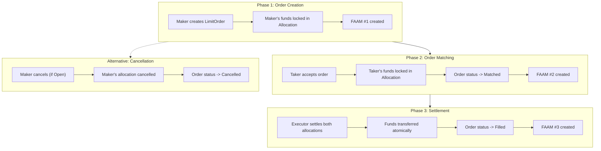

# Module 10: Capstone Project - Building a Complete DEX Feature

## Learning Objectives

By the end of this module, you will:

- Integrate all concepts from previous modules
- Design and implement a complete DEX feature
- Write comprehensive tests
- Document your solution

---

## 10.1 Project Overview

### Objective

Build a **Limit Order** feature for a decentralized exchange that allows traders to place orders at specific prices, which are matched when market conditions are met.

### Requirements

1. **Template Design** - Proposal-based workflow with factory pattern
2. **DVP Settlement** - Atomic settlement with reference binding
3. **CIP-56 Compliance** - Support for both fungible and Amulet tokens
4. **FAAM Integration** - Activity markers at key points
5. **Comprehensive Tests** - Happy path and error cases

---

## 10.2 Feature Specification

### LimitOrder Template

```haskell
-- Fields required:
-- - maker: Party (order creator)
-- - taker: Optional Party (order filler, None until matched)
-- - executor: Party (settlement authority)
-- - makerInstrumentId: InstrumentId (what maker offers)
-- - takerInstrumentId: InstrumentId (what maker wants)
-- - makerAmount: Decimal (amount maker offers)
-- - limitPrice: Decimal (price per unit maker wants)
-- - expiresAt: Time (order expiration)
-- - createdAt: Time
-- - status: OrderStatus (Open, Matched, Filled, Cancelled, Expired)
```

### Order Status Enum

```haskell
data OrderStatus =
    Open        -- Order is active and waiting for match
  | Matched     -- Order has been matched, awaiting settlement
  | Filled      -- Order has been settled
  | Cancelled   -- Order was cancelled by maker
  | Expired     -- Order expired without being filled
  deriving (Eq, Show)
```

### Workflow Phases



---

## 10.3 Implementation Tasks

### Task 1: Define Data Types

Create the necessary data types:

```haskell
module Project.LimitOrder.Types where

import Splice.Api.Token.HoldingV1 (InstrumentId)

data OrderStatus =
    Open
  | Matched
  | Filled
  | Cancelled
  | Expired
  deriving (Eq, Show)

data LimitOrderResult = LimitOrderResult with
  orderCid: ContractId LimitOrder
  makerAllocationCid: ContractId Allocation
  deriving (Show, Eq)

data MatchResult = MatchResult with
  orderCid: ContractId LimitOrder
  takerAllocationCid: ContractId Allocation
  deriving (Show, Eq)
```

### Task 2: Implement LimitOrderFactory

```haskell
template LimitOrderFactory with
    admin: Party
  where
    signatory admin

    nonconsuming choice CreateLimitOrder: LimitOrderResult
      with
        maker: Party
        executor: Party
        makerInstrumentId: InstrumentId
        takerInstrumentId: InstrumentId
        makerAmount: Decimal
        limitPrice: Decimal
        expiresAt: Time
        allocationArgs: AllocationArgs
      controller maker
      do
        -- Validations
        -- 1. makerAmount > 0
        -- 2. limitPrice > 0
        -- 3. expiresAt > now
        -- 4. makerInstrumentId /= takerInstrumentId
        -- 5. validateHoldings

        -- Generate order reference ID

        -- Create maker allocation

        -- Create LimitOrder with status = Open

        -- Create FAAM

        pure LimitOrderResult with ...
```

### Task 3: Implement LimitOrder Template

```haskell
template LimitOrder with
    maker: Party
    taker: Optional Party
    executor: Party
    makerInstrumentId: InstrumentId
    takerInstrumentId: InstrumentId
    makerAmount: Decimal
    limitPrice: Decimal
    orderReferenceId: Text
    makerAllocationCid: ContractId Allocation
    takerAllocationCid: Optional (ContractId Allocation)
    expiresAt: Time
    createdAt: Time
    status: OrderStatus
    featuredAppRightCidOpt: Optional (ContractId FeaturedAppRight)
  where
    signatory maker, executor
    observer fromOptional [] (fmap pure taker)

    ensure
      maker /= executor &&
      makerAmount > 0.0 &&
      limitPrice > 0.0 &&
      expiresAt > createdAt

    -- Choice: MatchOrder (taker accepts the order)
    choice MatchOrder: MatchResult
      with
        takerParty: Party
        takerAllocationArgs: AllocationArgs
      controller takerParty
      do
        -- Validate status == Open
        -- Validate not expired
        -- Validate taker amount matches (makerAmount * limitPrice)
        -- Create taker allocation
        -- Update order with taker, takerAllocationCid, status = Matched
        -- Create FAAM
        pure MatchResult with ...

    -- Choice: SettleOrder (executor settles matched order)
    choice SettleOrder: ()
      with
        amuletContext: Optional ChoiceContext
        beneficiaries: Optional [AppRewardBeneficiary]
      controller executor
      do
        -- Validate status == Matched
        -- Validate not expired
        -- Execute both allocations atomically
        -- Create FAAM
        pure ()

    -- Choice: CancelOrder (maker cancels open order)
    choice CancelOrder: ()
      with
        amuletContext: Optional ChoiceContext
      controller maker
      do
        -- Validate status == Open
        -- Cancel maker allocation
        -- Archive order
        pure ()
```

### Task 4: Write Tests

```haskell
module Tests.LimitOrder.LimitOrderTest where

import Daml.Script
import DA.Assert

-- Test 1: Happy path - create, match, settle
limitOrderHappyPath: Script ()
limitOrderHappyPath = do
  -- Setup
  -- Create limit order
  -- Match order
  -- Settle order
  -- Verify balances

-- Test 2: Order expiration
limitOrderExpiration: Script ()
limitOrderExpiration = do
  -- Create order with short expiration
  -- Wait until expired
  -- Verify match fails

-- Test 3: Order cancellation
limitOrderCancellation: Script ()
limitOrderCancellation = do
  -- Create order
  -- Cancel order
  -- Verify allocation returned

-- Test 4: Invalid matching
limitOrderInvalidMatch: Script ()
limitOrderInvalidMatch = do
  -- Create order
  -- Try to match with wrong amount
  -- Verify failure

-- Test 5: Double settlement prevention
limitOrderDoubleSettle: Script ()
limitOrderDoubleSettle = do
  -- Create and match order
  -- Settle order
  -- Try to settle again
  -- Verify failure
```

---

## 10.4 Implementation Checklist

### Phase 1: Setup

- [ ] Create project structure
- [ ] Define data types
- [ ] Import necessary modules

### Phase 2: Core Templates

- [ ] Implement LimitOrderFactory
- [ ] Implement LimitOrder template
- [ ] Add all choices

### Phase 3: Validation

- [ ] Add ensure clauses
- [ ] Add runtime validations
- [ ] Use validation helpers

### Phase 4: Integration

- [ ] Add FAAM creation
- [ ] Support Amulet context
- [ ] Handle both token types

### Phase 5: Testing

- [ ] Write happy path tests
- [ ] Write error case tests
- [ ] Write concurrent tests
- [ ] Verify all assertions pass

### Phase 6: Documentation

- [ ] Add Haddock comments
- [ ] Create usage examples
- [ ] Document design decisions

---

## 10.5 Grading Criteria

| Criterion | Points | Description |
|-----------|--------|-------------|
| **Template Design** | 20 | Correct structure, fields, signatories |
| **Choice Implementation** | 25 | All choices work correctly |
| **Validation** | 15 | Comprehensive validation |
| **DVP Settlement** | 15 | Atomic execution with reference binding |
| **CIP-56 Compliance** | 10 | Dual token support |
| **FAAM Integration** | 5 | Activity markers created |
| **Tests** | 5 | Comprehensive test coverage |
| **Code Quality** | 5 | Clean, documented code |
| **Total** | 100 | |

---

## 10.6 Extension Ideas

Once the basic implementation is complete, consider these enhancements:

### Partial Fills

Allow orders to be partially filled, creating change holdings.

### Order Book

Create an order book contract that matches buy/sell orders automatically.

### Price Oracle Integration

Add Chainlink oracle integration for price verification.

### Order Types

Implement additional order types:

- Market orders (fill at current price)
- Stop-loss orders (trigger when price falls below threshold)
- Take-profit orders (trigger when price rises above threshold)

---

## 10.7 Submission Guidelines

### Required Files

```text
project/
├── daml/
│   └── Project/
│       └── LimitOrder/
│           ├── Types.daml
│           ├── Factory.daml
│           └── LimitOrder.daml
├── tests/
│   └── LimitOrderTest.daml
└── docs/
    └── DESIGN.md
```

### Design Document Contents

1. **Overview** - What the feature does
2. **Architecture** - How it's structured
3. **Security** - How it prevents attacks
4. **Trade-offs** - Design decisions and alternatives
5. **Future Work** - Potential improvements

---

## 10.8 Summary

Congratulations on reaching the Capstone Project!

This project integrates everything you've learned:

1. **Module 1-2**: Template and choice fundamentals
2. **Module 3**: Testing patterns
3. **Module 4**: CIP-56 compliance
4. **Module 5**: DVP settlement
5. **Module 6**: Amulet integration
6. **Module 7**: Interface design
7. **Module 8**: FAAM integration
8. **Module 9**: Production patterns

Good luck with your implementation!

---

## Course Completion

Upon completing this course, you will have gained:

- Deep understanding of DAML smart contract development
- Practical experience with Canton Token Standard (CIP-56)
- Knowledge of DVP settlement patterns
- Skills in Amulet and FAAM integration
- Production-ready coding practices

Welcome to the Canton Network developer community!
