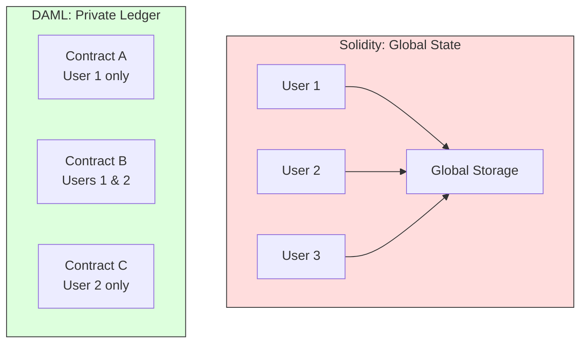
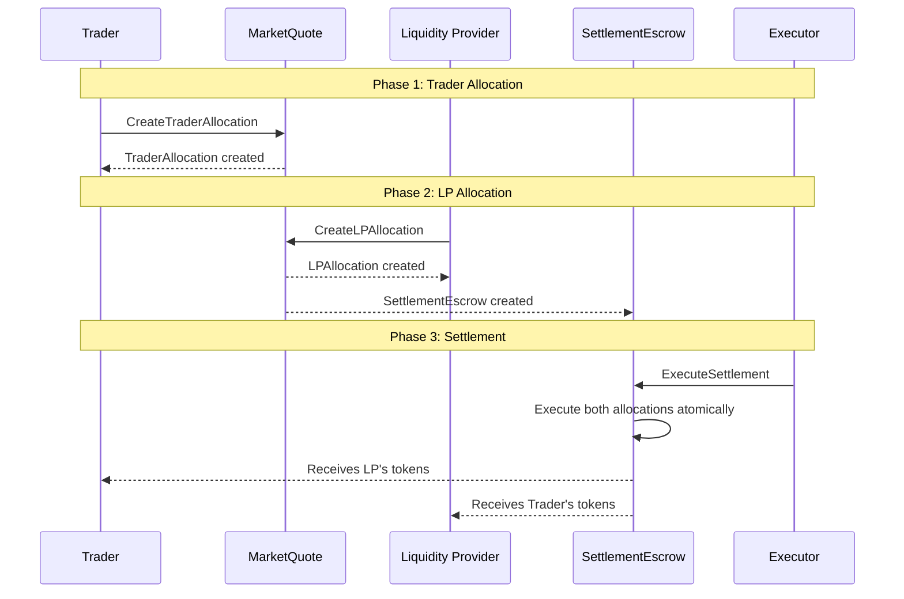

# Solidity to DAML: A Developer's Transition Guide

## Introduction

This guide helps developers familiar with Ethereum/EVM smart contract development transition to DAML. We compare common Solidity patterns with their DAML equivalents, highlighting key conceptual differences.

### Why This Guide?

If you've built smart contracts in Solidity, you understand concepts like:

- Token standards (ERC-20, ERC-721)
- Ownership patterns (Ownable)
- Access control (roles, modifiers)
- DEX mechanics (AMMs, order books)
- Escrow patterns

DAML approaches these same problems differently. Understanding the mapping between paradigms accelerates your learning.

---

## Fundamental Differences

Before diving into patterns, understand these core differences:

| Aspect | Solidity/EVM | DAML |
|--------|--------------|------|
| **State Model** | Global shared state (all data public) | Per-party private state (need-to-know basis) |
| **Authorization** | `msg.sender` checks | Signatories and controllers |
| **Execution** | Gas-metered, can fail mid-execution | Atomic transactions, all-or-nothing |
| **Privacy** | Everything on-chain is public | Only authorized parties see contracts |
| **Upgradeability** | Proxy patterns, complex migrations | Built-in contract upgrades |
| **Concurrency** | Global state conflicts | Per-contract, no global conflicts |



---

## Pattern 1: ERC-20 Token vs DAML Holding

### Solidity: ERC-20 Token

```solidity
// SPDX-License-Identifier: MIT
pragma solidity ^0.8.20;

import "@openzeppelin/contracts/token/ERC20/ERC20.sol";

contract MyToken is ERC20 {
    address public admin;

    constructor(string memory name, string memory symbol) ERC20(name, symbol) {
        admin = msg.sender;
    }

    function mint(address to, uint256 amount) external {
        require(msg.sender == admin, "Only admin can mint");
        _mint(to, amount);
    }

    function transfer(address to, uint256 amount) public override returns (bool) {
        require(to != address(0), "Cannot transfer to zero address");
        return super.transfer(to, amount);
    }
}
```

**Key Characteristics:**

- Single contract tracks ALL balances in a mapping
- `msg.sender` determines who is calling
- Balances are public (anyone can query)
- Transfer is a single function call

### DAML: Holding (CIP-56)

```haskell
-- Token identity (like token address in Solidity)
data InstrumentId = InstrumentId
  with
    admin: Party      -- Issuer/admin of the token
    id: Text          -- Unique identifier
  deriving (Show, Eq)

-- A Holding represents token ownership (like a balance entry)
-- Each holder has their own Holding contracts
interface Holding where
  viewtype HoldingView

data HoldingView = HoldingView
  with
    owner: Party           -- Who owns this holding
    instrument: InstrumentId
    amount: Decimal        -- Amount held
    lock: Optional Lock    -- Optional lock for settlements
    meta: Metadata         -- Additional metadata
  deriving (Show, Eq)

-- Simplified Holding template implementation
template FungibleHolding with
    owner: Party
    custodian: Party
    instrument: InstrumentId
    amount: Decimal
    lock: Optional Lock
  where
    signatory custodian, owner

    ensure amount > 0.0

    interface instance Holding for FungibleHolding where
      view = HoldingView with
        owner
        instrument
        amount
        lock
        meta = emptyMetadata
```

**Key Characteristics:**

- Each owner has separate Holding contracts (no global mapping)
- Only owner and custodian can see their holdings
- Transfer creates new contracts (immutable)
- Amount validation in `ensure` clause

### Comparison Table

| Feature | ERC-20 | DAML Holding |
|---------|--------|--------------|
| Balance storage | Global mapping | Individual contracts |
| Visibility | Public | Only owner/custodian |
| Transfer mechanism | Update mapping | Archive old, create new |
| Authorization | `msg.sender` | Signatories |
| Decimal precision | uint256 (fixed) | Decimal (arbitrary) |

### Transfer Comparison

**Solidity Transfer:**

```solidity
// Single state mutation
function transfer(address to, uint256 amount) public returns (bool) {
    _balances[msg.sender] -= amount;
    _balances[to] += amount;
    emit Transfer(msg.sender, to, amount);
    return true;
}
```

**DAML Transfer:**

```haskell
-- Transfer creates new holdings
choice Transfer: ContractId Holding
  with
    newOwner: Party
  controller owner
  do
    -- Archive this holding (consuming choice)
    -- Create new holding for recipient
    create this with owner = newOwner
```

---

## Pattern 2: Ownership (Ownable)

### Solidity: OpenZeppelin Ownable

```solidity
// SPDX-License-Identifier: MIT
pragma solidity ^0.8.20;

import "@openzeppelin/contracts/access/Ownable.sol";

contract MyContract is Ownable {
    uint256 public value;

    constructor() Ownable(msg.sender) {}

    function setValue(uint256 _value) external onlyOwner {
        value = _value;
    }

    function transferOwnership(address newOwner) public override onlyOwner {
        require(newOwner != address(0), "New owner is zero address");
        _transferOwnership(newOwner);
    }
}
```

**Pattern:**

- `onlyOwner` modifier restricts functions
- Single `owner` state variable
- Ownership transfer is a state mutation

### DAML: Signatory-Based Ownership

```haskell
template OwnedAsset with
    owner: Party
    value: Decimal
  where
    -- Owner MUST sign to create or archive this contract
    signatory owner

    -- Only owner can update value (consuming choice = archive + recreate)
    choice SetValue: ContractId OwnedAsset
      with
        newValue: Decimal
      controller owner
      do
        create this with value = newValue

    -- Transfer ownership requires BOTH parties to sign
    choice TransferOwnership: ContractId OwnedAsset
      with
        newOwner: Party
      controller owner, newOwner  -- Both must authorize!
      do
        create this with owner = newOwner
```

**Key Differences:**

| Aspect | Solidity Ownable | DAML Signatory |
|--------|------------------|----------------|
| Authorization | Runtime check (`require`) | Compile-time + ledger enforced |
| Ownership transfer | Owner decides alone | Requires new owner consent |
| Visibility | Anyone can see owner | Only signatories see contract |
| Revocation | Owner can always act | Archived contracts are gone |

### Two-Step Ownership Transfer

**Solidity (OpenZeppelin Ownable2Step):**

```solidity
contract MyContract is Ownable2Step {
    // Step 1: Owner initiates transfer
    function transferOwnership(address newOwner) public override onlyOwner {
        _pendingOwner = newOwner;
    }

    // Step 2: New owner accepts
    function acceptOwnership() public {
        require(msg.sender == _pendingOwner, "Not pending owner");
        _transferOwnership(msg.sender);
    }
}
```

#### DAML: Proposal Pattern (Natural)

```haskell
-- Ownership is inherently two-step in DAML
-- because new owner must be signatory

template OwnershipProposal with
    currentOwner: Party
    proposedOwner: Party
    assetCid: ContractId OwnedAsset
  where
    signatory currentOwner
    observer proposedOwner

    -- Proposed owner accepts
    choice Accept: ContractId OwnedAsset
      controller proposedOwner
      do
        asset <- fetch assetCid
        archive assetCid
        create asset with owner = proposedOwner

    -- Current owner can cancel
    choice Cancel: ()
      controller currentOwner
      do pure ()
```

> **Insight:** DAML's signatory model naturally enforces consent-based transfers. What requires explicit patterns in Solidity (Ownable2Step) is the default behavior in DAML.

---

## Pattern 3: Role-Based Access Control

### Solidity: OpenZeppelin AccessControl

```solidity
// SPDX-License-Identifier: MIT
pragma solidity ^0.8.20;

import "@openzeppelin/contracts/access/AccessControl.sol";

contract Treasury is AccessControl {
    bytes32 public constant ADMIN_ROLE = keccak256("ADMIN_ROLE");
    bytes32 public constant TREASURER_ROLE = keccak256("TREASURER_ROLE");
    bytes32 public constant AUDITOR_ROLE = keccak256("AUDITOR_ROLE");

    uint256 public balance;

    constructor() {
        _grantRole(DEFAULT_ADMIN_ROLE, msg.sender);
        _grantRole(ADMIN_ROLE, msg.sender);
    }

    function deposit() external payable {
        balance += msg.value;
    }

    function withdraw(uint256 amount) external onlyRole(TREASURER_ROLE) {
        require(amount <= balance, "Insufficient balance");
        balance -= amount;
        payable(msg.sender).transfer(amount);
    }

    function audit() external view onlyRole(AUDITOR_ROLE) returns (uint256) {
        return balance;
    }

    function grantTreasurer(address account) external onlyRole(ADMIN_ROLE) {
        _grantRole(TREASURER_ROLE, account);
    }
}
```

### DAML: Multi-Party Authorization

```haskell
-- Roles are represented as parties with specific rights
template Treasury with
    admin: Party
    treasurers: [Party]
    auditors: [Party]
    balance: Decimal
  where
    signatory admin
    observer treasurers, auditors

    -- Admin can add/remove roles
    nonconsuming choice AddTreasurer: ContractId Treasury
      with
        newTreasurer: Party
      controller admin
      do
        create this with treasurers = newTreasurer :: treasurers

    -- Any treasurer can withdraw
    choice Withdraw: ContractId Treasury
      with
        amount: Decimal
        caller: Party
      controller caller
      do
        assertMsg "Caller must be treasurer" (caller `elem` treasurers)
        assertMsg "Insufficient balance" (amount <= balance)
        create this with balance = balance - amount

    -- Auditors can query (non-consuming = read-only)
    nonconsuming choice Audit: Decimal
      controller auditors
      do pure balance

-- Alternative: Separate role contracts for fine-grained control
template TreasurerRole with
    admin: Party
    treasurer: Party
    treasuryId: Text
  where
    signatory admin, treasurer

    -- Role can be revoked by admin
    choice RevokeRole: ()
      controller admin
      do pure ()
```

### Advanced: Hierarchical Roles with Interfaces

```haskell
-- Interface for role-based actions
interface Permissioned where
  viewtype PermissionView

  -- Check if party has permission
  hasPermission: Party -> Text -> Bool

data PermissionView = PermissionView
  with
    admin: Party
    permissions: [(Party, [Text])]  -- Party -> list of permissions

-- Implementation with granular permissions
template PermissionedResource with
    admin: Party
    permissions: [(Party, [Text])]
    resourceData: Text
  where
    signatory admin
    observer (map fst permissions)

    interface instance Permissioned for PermissionedResource where
      view = PermissionView with admin; permissions
      hasPermission party permission =
        case lookup party permissions of
          None -> False
          Some perms -> permission `elem` perms

    nonconsuming choice ExecuteAction: ()
      with
        caller: Party
        action: Text
      controller caller
      do
        let perms = view (toInterface @Permissioned this)
        assertMsg "Permission denied" (hasPermission perms caller action)
        -- Execute action...
        pure ()
```

### Access Control Comparison

| Feature | Solidity AccessControl | DAML |
|---------|----------------------|------|
| Role storage | On-chain mapping | Party lists or separate contracts |
| Role check | Runtime modifier | `assertMsg` or controller |
| Visibility | Public (who has roles) | Private (only relevant parties see) |
| Hierarchy | Role admin mechanism | Explicit in contract structure |
| Revocation | Single tx by admin | May require consent (signatory) |

---

## Pattern 4: DEX / Exchange Patterns

### Solidity: Uniswap-Style AMM

```solidity
// SPDX-License-Identifier: MIT
pragma solidity ^0.8.20;

import "@openzeppelin/contracts/token/ERC20/IERC20.sol";

contract SimpleAMM {
    IERC20 public tokenA;
    IERC20 public tokenB;

    uint256 public reserveA;
    uint256 public reserveB;

    constructor(address _tokenA, address _tokenB) {
        tokenA = IERC20(_tokenA);
        tokenB = IERC20(_tokenB);
    }

    // Constant product formula: x * y = k
    function swap(address tokenIn, uint256 amountIn) external returns (uint256 amountOut) {
        require(tokenIn == address(tokenA) || tokenIn == address(tokenB), "Invalid token");

        bool isTokenA = tokenIn == address(tokenA);
        (IERC20 inputToken, IERC20 outputToken, uint256 reserveIn, uint256 reserveOut) =
            isTokenA
                ? (tokenA, tokenB, reserveA, reserveB)
                : (tokenB, tokenA, reserveB, reserveA);

        // Transfer tokens in
        inputToken.transferFrom(msg.sender, address(this), amountIn);

        // Calculate output: dy = (y * dx) / (x + dx)
        amountOut = (reserveOut * amountIn) / (reserveIn + amountIn);

        // Transfer tokens out
        outputToken.transfer(msg.sender, amountOut);

        // Update reserves
        if (isTokenA) {
            reserveA += amountIn;
            reserveB -= amountOut;
        } else {
            reserveB += amountIn;
            reserveA -= amountOut;
        }
    }
}
```

**Characteristics:**

- Global liquidity pool
- Automatic price discovery (constant product)
- Single transaction swap
- MEV vulnerable (front-running)

### DAML: DVP Settlement (Delivery vs Payment)

```haskell
-- Market Quote: LP posts prices (like limit orders)
template MarketQuote with
    liquidityProvider: Party
    executor: Party
    baseInstrument: InstrumentId      -- e.g., USDT
    quoteInstrument: InstrumentId     -- e.g., CC token
    bidPrice: Decimal                  -- LP buys base at this price
    askPrice: Decimal                  -- LP sells base at this price
    minAmount: Decimal
    maxAmount: Decimal
    expiresAt: Time
  where
    signatory liquidityProvider, executor

    ensure
      bidPrice > 0.0 &&
      askPrice > 0.0 &&
      askPrice >= bidPrice &&  -- Spread
      minAmount > 0.0 &&
      maxAmount >= minAmount

    -- Trader creates allocation (Phase 1)
    nonconsuming choice CreateTraderAllocation: TraderAllocationResult
      with
        trader: Party
        direction: TradeDirection  -- Buy or Sell
        baseAmount: Decimal
        traderHoldingCid: ContractId Holding
      controller trader
      do
        -- Validate amount within limits
        assertMsg "Amount below minimum" (baseAmount >= minAmount)
        assertMsg "Amount above maximum" (baseAmount <= maxAmount)

        -- Calculate quote amount based on direction
        let quoteAmount = case direction of
              Buy -> baseAmount * askPrice   -- Trader pays quote, gets base
              Sell -> baseAmount * bidPrice  -- Trader pays base, gets quote

        -- Create allocation (pre-commitment)
        -- ... allocation creation logic
        pure TraderAllocationResult with ...

-- Settlement Escrow: Atomic execution
template SettlementEscrow with
    trader: Party
    liquidityProvider: Party
    executor: Party
    traderAllocationCid: ContractId Allocation
    lpAllocationCid: ContractId Allocation
    settleBy: Time
  where
    signatory trader, liquidityProvider
    observer executor

    -- Atomic settlement (both transfers or neither)
    choice ExecuteSettlement: SettlementResult
      controller executor
      do
        now <- getTime
        assertMsg "Settlement expired" (now < settleBy)

        -- Execute both allocations atomically
        traderResult <- exercise traderAllocationCid ExecuteTransfer
        lpResult <- exercise lpAllocationCid ExecuteTransfer

        pure SettlementResult with
          traderTransfer = traderResult
          lpTransfer = lpResult

    -- Cancel if expired
    choice CancelSettlement: ()
      controller executor
      do
        now <- getTime
        assertMsg "Cannot cancel before expiry" (now >= settleBy)
        -- Return allocations to original holders
        exercise traderAllocationCid Cancel
        exercise lpAllocationCid Cancel
```

### Three-Phase Settlement Flow



### Key Differences: AMM vs DVP

| Feature | Solidity AMM | DAML DVP |
|---------|--------------|----------|
| Price discovery | Automatic (formula) | Quote-based (LP sets prices) |
| Liquidity | Pooled (global) | Per-quote (LP's holdings) |
| Atomicity | Single tx | Multi-phase with escrow |
| MEV resistance | Vulnerable | Protected (private quotes) |
| Privacy | All trades public | Only parties see their trades |
| Slippage | Price impact | Fixed quote prices |
| Settlement | Immediate | Can have timeout/expiry |

### Order Book Pattern (Alternative)

```haskell
-- Limit order (like traditional exchange)
template LimitOrder with
    maker: Party
    executor: Party
    instrument: InstrumentId
    side: OrderSide          -- Buy or Sell
    price: Decimal
    quantity: Decimal
    filledQuantity: Decimal
    expiresAt: Time
  where
    signatory maker, executor

    ensure
      price > 0.0 &&
      quantity > 0.0 &&
      filledQuantity >= 0.0 &&
      filledQuantity <= quantity

    -- Match against this order
    nonconsuming choice MatchOrder: MatchResult
      with
        taker: Party
        matchQuantity: Decimal
        takerHoldingCid: ContractId Holding
      controller taker
      do
        now <- getTime
        assertMsg "Order expired" (now < expiresAt)

        let remainingQty = quantity - filledQuantity
        assertMsg "Insufficient quantity" (matchQuantity <= remainingQty)

        -- Create settlement escrow for the match
        -- ... matching logic
        pure MatchResult with ...
```

---

## Pattern 5: Escrow Patterns

### Solidity: Basic Escrow

```solidity
// SPDX-License-Identifier: MIT
pragma solidity ^0.8.20;

contract Escrow {
    address public buyer;
    address public seller;
    address public arbiter;
    uint256 public amount;

    enum State { Created, Funded, Released, Refunded }
    State public state;

    constructor(address _seller, address _arbiter) {
        buyer = msg.sender;
        seller = _seller;
        arbiter = _arbiter;
        state = State.Created;
    }

    function deposit() external payable {
        require(msg.sender == buyer, "Only buyer can deposit");
        require(state == State.Created, "Invalid state");
        amount = msg.value;
        state = State.Funded;
    }

    function release() external {
        require(msg.sender == buyer || msg.sender == arbiter, "Not authorized");
        require(state == State.Funded, "Invalid state");
        state = State.Released;
        payable(seller).transfer(amount);
    }

    function refund() external {
        require(msg.sender == seller || msg.sender == arbiter, "Not authorized");
        require(state == State.Funded, "Invalid state");
        state = State.Refunded;
        payable(buyer).transfer(amount);
    }
}
```

### DAML: Escrow with Multi-Party Consent

```haskell
-- State represented by different contract types (state machine pattern)

-- Initial proposal
template EscrowProposal with
    buyer: Party
    seller: Party
    arbiter: Party
    amount: Decimal
    description: Text
  where
    signatory buyer
    observer seller, arbiter

    -- Seller accepts, creating funded escrow
    choice AcceptProposal: ContractId FundedEscrow
      with
        buyerHoldingCid: ContractId Holding
      controller seller
      do
        -- Verify buyer has funded
        holding <- fetch buyerHoldingCid
        let holdingView = view (toInterface @Holding holding)
        assertMsg "Insufficient funds" (holdingView.amount >= amount)

        create FundedEscrow with
          buyer
          seller
          arbiter
          amount
          fundsCid = buyerHoldingCid
          description

    -- Buyer can cancel proposal
    choice CancelProposal: ()
      controller buyer
      do pure ()

-- Funded escrow (funds locked)
template FundedEscrow with
    buyer: Party
    seller: Party
    arbiter: Party
    amount: Decimal
    fundsCid: ContractId Holding
    description: Text
  where
    signatory buyer, seller
    observer arbiter

    -- Release to seller (buyer approves or arbiter decides)
    choice Release: ContractId Holding
      controller buyer
      do
        -- Transfer funds to seller
        exercise fundsCid Transfer with newOwner = seller

    -- Arbiter can also release
    choice ArbiterRelease: ContractId Holding
      controller arbiter
      do
        exercise fundsCid Transfer with newOwner = seller

    -- Refund to buyer (seller approves or arbiter decides)
    choice Refund: ContractId Holding
      controller seller
      do
        -- Funds already belong to buyer, just unlock
        pure fundsCid

    choice ArbiterRefund: ContractId Holding
      controller arbiter
      do
        pure fundsCid

    -- Both parties can mutually cancel
    choice MutualCancel: ContractId Holding
      controller buyer, seller
      do
        pure fundsCid
```

### Time-Locked Escrow

```haskell
template TimedEscrow with
    buyer: Party
    seller: Party
    amount: Decimal
    fundsCid: ContractId Holding
    releaseTime: Time      -- Auto-release after this time
    refundTime: Time       -- Buyer can refund after this time
  where
    signatory buyer, seller

    ensure releaseTime < refundTime

    -- Seller can claim after release time
    choice ClaimFunds: ContractId Holding
      controller seller
      do
        now <- getTime
        assertMsg "Too early to claim" (now >= releaseTime)
        exercise fundsCid Transfer with newOwner = seller

    -- Buyer can refund after refund time (if seller didn't claim)
    choice ClaimRefund: ContractId Holding
      controller buyer
      do
        now <- getTime
        assertMsg "Too early to refund" (now >= refundTime)
        pure fundsCid
```

### Escrow Pattern Comparison

| Feature | Solidity Escrow | DAML Escrow |
|---------|-----------------|-------------|
| State management | Enum + require | Separate templates |
| Fund locking | Contract holds ETH | Allocation/Holding reference |
| Multi-party | OR logic in require | Multiple controllers |
| State transitions | Mutable state | Create new contracts |
| Visibility | All states public | Only parties see their escrow |

---

## Pattern 6: Factory Patterns

### Solidity: Clone Factory

```solidity
// SPDX-License-Identifier: MIT
pragma solidity ^0.8.20;

import "@openzeppelin/contracts/proxy/Clones.sol";

contract TokenFactory {
    address public implementation;
    address[] public deployedTokens;

    event TokenCreated(address indexed token, address indexed creator);

    constructor(address _implementation) {
        implementation = _implementation;
    }

    function createToken(
        string memory name,
        string memory symbol,
        uint256 initialSupply
    ) external returns (address) {
        address clone = Clones.clone(implementation);
        IToken(clone).initialize(name, symbol, initialSupply, msg.sender);
        deployedTokens.push(clone);
        emit TokenCreated(clone, msg.sender);
        return clone;
    }

    function getDeployedTokens() external view returns (address[] memory) {
        return deployedTokens;
    }
}
```

### DAML: Factory Template

```haskell
-- Factory controls who can create contracts
template TokenFactory with
    admin: Party
    allowedIssuers: [Party]
  where
    signatory admin
    observer allowedIssuers

    -- Non-consuming: factory persists after creating tokens
    nonconsuming choice CreateToken: ContractId Token
      with
        issuer: Party
        name: Text
        symbol: Text
        initialSupply: Decimal
      controller issuer
      do
        assertMsg "Not authorized issuer" (issuer `elem` allowedIssuers)
        create Token with
          issuer
          name
          symbol
          totalSupply = initialSupply

    -- Admin can add issuers
    nonconsuming choice AddIssuer: ContractId TokenFactory
      with
        newIssuer: Party
      controller admin
      do
        create this with allowedIssuers = newIssuer :: allowedIssuers

-- Token created by factory
template Token with
    issuer: Party
    name: Text
    symbol: Text
    totalSupply: Decimal
  where
    signatory issuer
```

### Allocation Factory (CIP-56 Pattern)

```haskell
-- Factory for creating token allocations
template AllocationFactory with
    provider: Party       -- Factory provider (custodian)
    instrument: InstrumentId
  where
    signatory provider

    -- Create allocation for settlement
    nonconsuming choice CreateAllocation: ContractId Allocation
      with
        owner: Party
        amount: Decimal
        holdingCid: ContractId Holding
        reference: Reference
        executeAfter: Time
        executeBefore: Time
      controller owner
      do
        -- Validate holding belongs to owner
        holding <- fetch holdingCid
        let hv = view (toInterface @Holding holding)
        assertMsg "Not holding owner" (hv.owner == owner)
        assertMsg "Insufficient balance" (hv.amount >= amount)
        assertMsg "Wrong instrument" (hv.instrument == instrument)

        -- Lock the holding
        lockedHoldingCid <- exercise holdingCid Lock with
          locker = owner
          lockExpiry = executeBefore
          lockContext = reference.id

        -- Create allocation
        create Allocation with
          owner
          amount
          holdingCid = lockedHoldingCid
          reference
          executeAfter
          executeBefore
```

### Factory Pattern Comparison

| Feature | Solidity Factory | DAML Factory |
|---------|------------------|--------------|
| Persistence | Contract always exists | Non-consuming choice |
| Access control | Owner check | Controller + assertMsg |
| Created contracts | Address tracking | ContractId returned |
| Gas efficiency | Clone pattern | N/A (no gas) |
| Discoverability | Events + array | Query by template |

---

## Pattern 7: Error Handling

### Solidity: Require, Revert, Assert

```solidity
contract ErrorHandling {
    error InsufficientBalance(uint256 available, uint256 required);
    error Unauthorized(address caller);

    function transfer(address to, uint256 amount) external {
        // require: input validation
        require(to != address(0), "Invalid recipient");
        require(amount > 0, "Amount must be positive");

        // Custom error (gas efficient)
        if (balances[msg.sender] < amount) {
            revert InsufficientBalance(balances[msg.sender], amount);
        }

        // assert: invariant check (should never fail)
        assert(totalSupply >= amount);

        // ... transfer logic
    }
}
```

### DAML: Ensure, AssertMsg, Abort

```haskell
template Transfer with
    sender: Party
    receiver: Party
    amount: Decimal
  where
    signatory sender, receiver

    -- ensure: contract invariant (checked at creation)
    ensure
      sender /= receiver &&
      amount > 0.0

-- In choice body:
choice ExecuteTransfer: TransferResult
  controller sender
  do
    -- assertMsg: runtime validation
    assertMsg "Insufficient balance" (senderBalance >= amount)

    -- Alternative: abort with message
    when (receiverBlocked) $ abort "Receiver is blocked"

    -- Pattern matching for optional handling
    case maybeHolding of
      None -> abort "No holding found"
      Some holding -> do
        -- proceed with holding
        pure ()
```

### Result Types for Recoverable Errors

```haskell
-- Solidity equivalent: try/catch or return (bool, result)
data TransferResult
  = TransferSuccess (ContractId Holding)
  | TransferFailed Text
  deriving (Show, Eq)

choice SafeTransfer: TransferResult
  controller sender
  do
    if senderBalance < amount
      then pure (TransferFailed "Insufficient balance")
      else do
        newHolding <- create Holding with ...
        pure (TransferSuccess newHolding)
```

### Error Handling Comparison

| Pattern | Solidity | DAML |
|---------|----------|------|
| Input validation | `require()` | `assertMsg` |
| Invariants | `assert()` | `ensure` |
| Custom errors | `error` + `revert` | `abort` with message |
| Recoverable | Return tuple/struct | Result data type |
| Gas refund | Partial (revert) | N/A |

---

## Pattern 8: Events and Queries

### Solidity: Events

```solidity
contract TokenWithEvents {
    event Transfer(address indexed from, address indexed to, uint256 amount);
    event Approval(address indexed owner, address indexed spender, uint256 amount);

    function transfer(address to, uint256 amount) external {
        // ... transfer logic
        emit Transfer(msg.sender, to, amount);
    }
}
```

**Usage:** Events are indexed and queryable via eth_getLogs.

### DAML: Contract Queries

```haskell
-- In DAML, contracts themselves are queryable
-- No separate event emission needed

-- Daml.Script for querying
testQuery = script do
    alice <- allocateParty "Alice"
    bob <- allocateParty "Bob"

    -- Query all Holdings for alice
    aliceHoldings <- queryFilter @Holding alice
      (\h -> (view h).owner == alice)

    -- Query specific contract
    optHolding <- queryContractId alice holdingCid

    -- Query by interface
    allocations <- queryInterface @Allocation alice

    pure ()
```

### Activity Markers (FAAM)

```haskell
-- For analytics/tracking, create marker contracts
template ActivityMarker with
    app: Party
    user: Party
    action: Text
    timestamp: Time
    metadata: TextMap Text
  where
    signatory app
    observer user

-- Create markers during operations
choice TransferWithTracking: TransferResult
  controller sender
  do
    now <- getTime

    -- Perform transfer
    result <- doTransfer ...

    -- Create activity marker
    create ActivityMarker with
      app = appParty
      user = sender
      action = "transfer"
      timestamp = now
      metadata = TextMap.fromList
        [ ("amount", show amount)
        , ("recipient", show receiver)
        ]

    pure result
```

### Events and Queries Comparison

| Feature | Solidity Events | DAML Queries |
|---------|-----------------|--------------|
| Storage | Log (not state) | Contracts on ledger |
| Indexing | Topic-based | Template/Interface based |
| Privacy | Public | Party-scoped |
| Historical | Always available | Archived contracts prunable |
| Real-time | Event subscription | Ledger subscription |

---

## Quick Reference: Solidity to DAML Mapping

### Keywords and Concepts

| Solidity | DAML | Notes |
|----------|------|-------|
| `contract` | `template` | Contract definition |
| `address` | `Party` | Identity/account |
| `msg.sender` | Controller | Who's executing |
| `mapping` | Individual contracts | No global state |
| `modifier` | `controller` + `assertMsg` | Access control |
| `require()` | `assertMsg` | Runtime validation |
| `assert()` | `ensure` | Invariants |
| `event` | Contract creation | Queryable history |
| `view` | Non-consuming choice | Read-only |
| `payable` | N/A | No native currency |
| `constructor` | Template fields | Initial state |
| `selfdestruct` | Archive (consuming) | Remove contract |

### Common Patterns

| Pattern | Solidity | DAML |
|---------|----------|------|
| Token | ERC-20 mapping | Holding contracts |
| Ownership | Ownable | Signatory |
| Access Control | AccessControl | Controllers + Parties |
| Upgrades | Proxy pattern | Built-in upgrade |
| Factory | Clone/Create | Non-consuming choice |
| State Machine | Enum + require | Multiple templates |
| Oracle | Chainlink | Explicit party input |

---

## Migration Checklist

When converting a Solidity contract to DAML:

### 1. Identify Parties

```solidity
// Solidity: implicit msg.sender
function transfer(address to, uint256 amount) external { ... }
```

```haskell
-- DAML: explicit parties
template Transfer with
    sender: Party      -- Was msg.sender
    receiver: Party    -- Was 'to' parameter
```

### 2. Convert State to Contracts

```solidity
// Solidity: global mapping
mapping(address => uint256) public balances;
```

```haskell
-- DAML: individual contracts per holder
template Holding with
    owner: Party
    amount: Decimal
```

### 3. Replace Modifiers with Controllers

```solidity
// Solidity
modifier onlyOwner() {
    require(msg.sender == owner, "Not owner");
    _;
}
```

```haskell
-- DAML
choice OwnerAction: ()
  controller owner    -- Only owner can execute
  do ...
```

### 4. Convert Events to Contracts or Markers

```solidity
// Solidity
event Transfer(address from, address to, uint256 amount);
emit Transfer(msg.sender, to, amount);
```

```haskell
-- DAML: contract creation IS the record
-- Alternatively, create explicit activity markers
```

### 5. Handle Privacy

```solidity
// Solidity: everything public
uint256 public balance;
```

```haskell
-- DAML: explicit visibility
template Account with
    owner: Party
    balance: Decimal
  where
    signatory owner           -- Only owner sees full contract
    observer auditor          -- Auditor can also see
```

---

## Summary

### Key Mindset Shifts

1. **From Global State to Private Contracts**
   - Solidity: Single contract, shared state
   - DAML: Many contracts, party-specific visibility

2. **From `msg.sender` to Signatories**
   - Solidity: Runtime caller check
   - DAML: Cryptographic authorization requirement

3. **From Mutations to Immutability**
   - Solidity: Update state variables
   - DAML: Archive old, create new contracts

4. **From Public to Private-by-Default**
   - Solidity: All data readable by anyone
   - DAML: Only authorized parties see contracts

5. **From Gas Optimization to Clarity**
   - Solidity: Optimize for gas costs
   - DAML: Optimize for correctness and clarity

### When to Use Each

| Use Case | Better Choice | Reason |
|----------|---------------|--------|
| Public DeFi | Solidity/EVM | Global liquidity, composability |
| Enterprise B2B | DAML | Privacy, compliance, auditability |
| Regulated Finance | DAML | Privacy, explicit authorization |
| NFT Marketplace | Solidity/EVM | Public visibility, existing ecosystem |
| Supply Chain | DAML | Multi-party privacy, complex workflows |
| Cross-org Settlement | DAML | Privacy, atomic multi-party transactions |

---

## Next Steps

After understanding these comparisons:

1. Start with [Module 1: DAML Fundamentals](module-01-daml-fundamentals.md)
2. Practice with the exercises in each module
3. Build the [Capstone Project](module-10-capstone-project.md)

The patterns you know from Solidity will help you understand DAML faster. The key is embracing the paradigm shift from global shared state to privacy-preserving, party-centric contracts.
